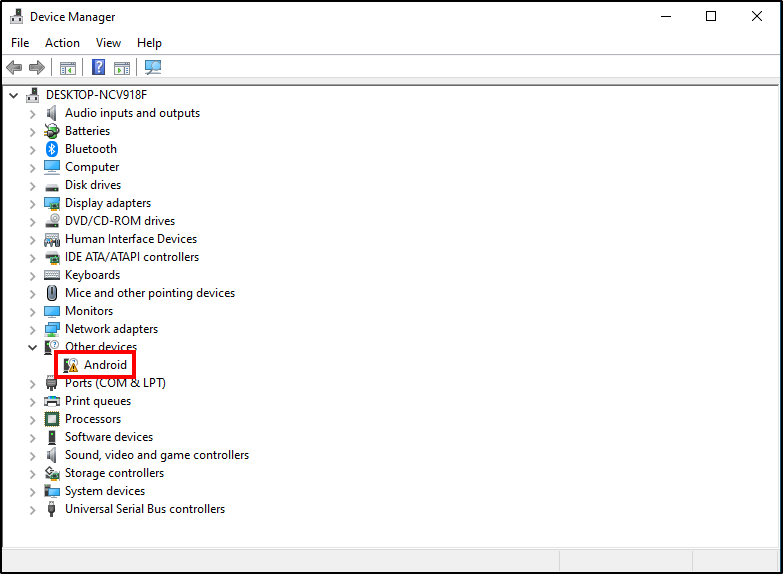
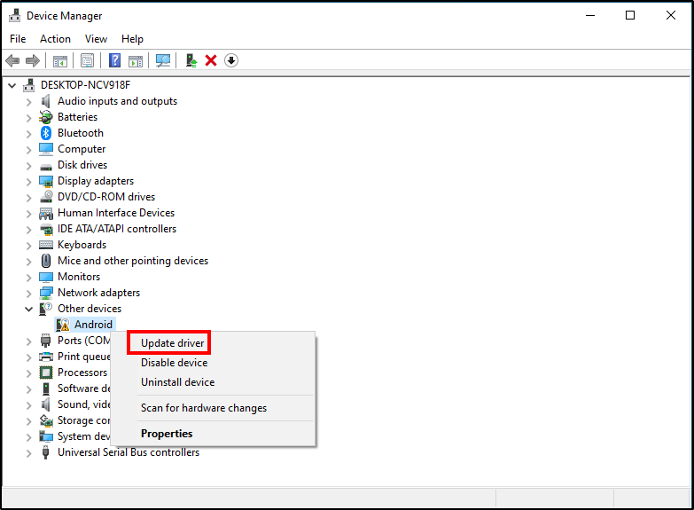
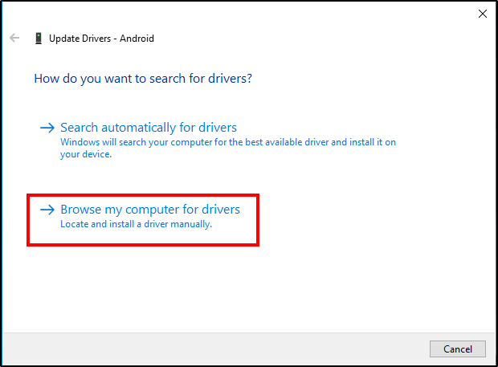
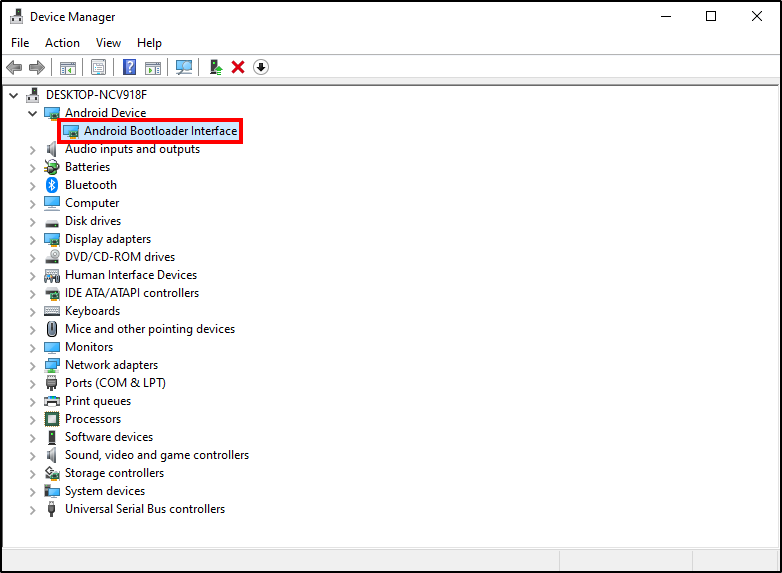
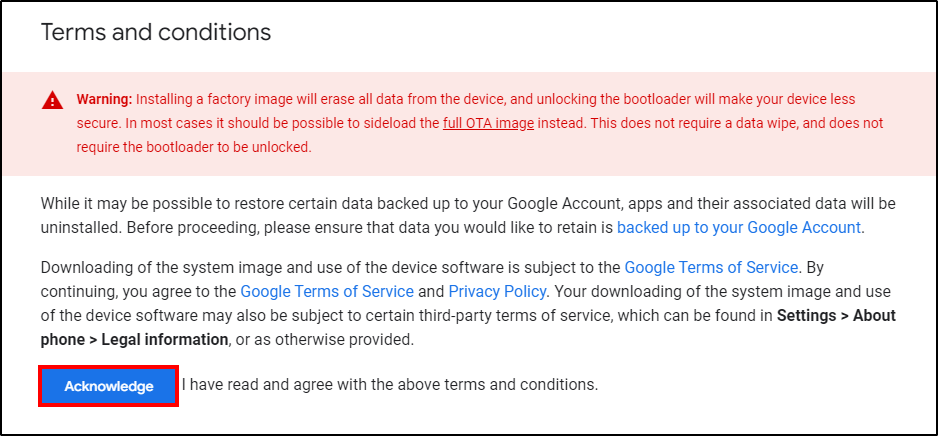
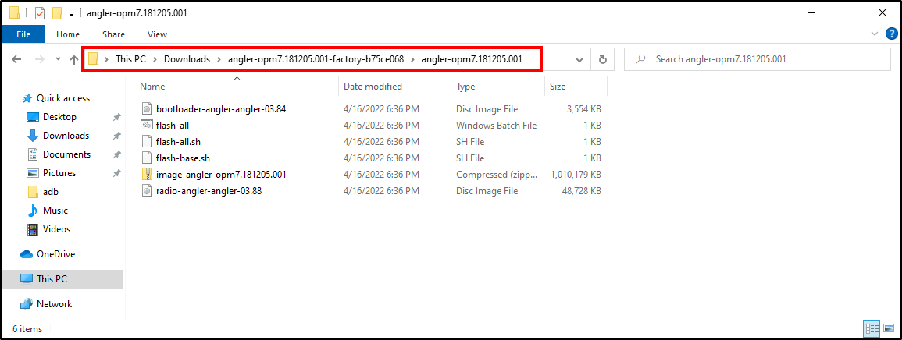
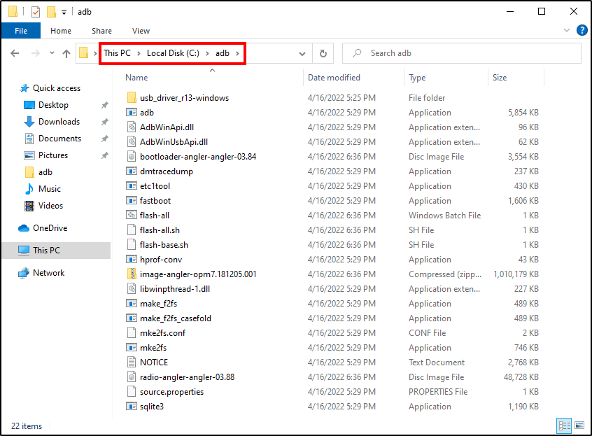
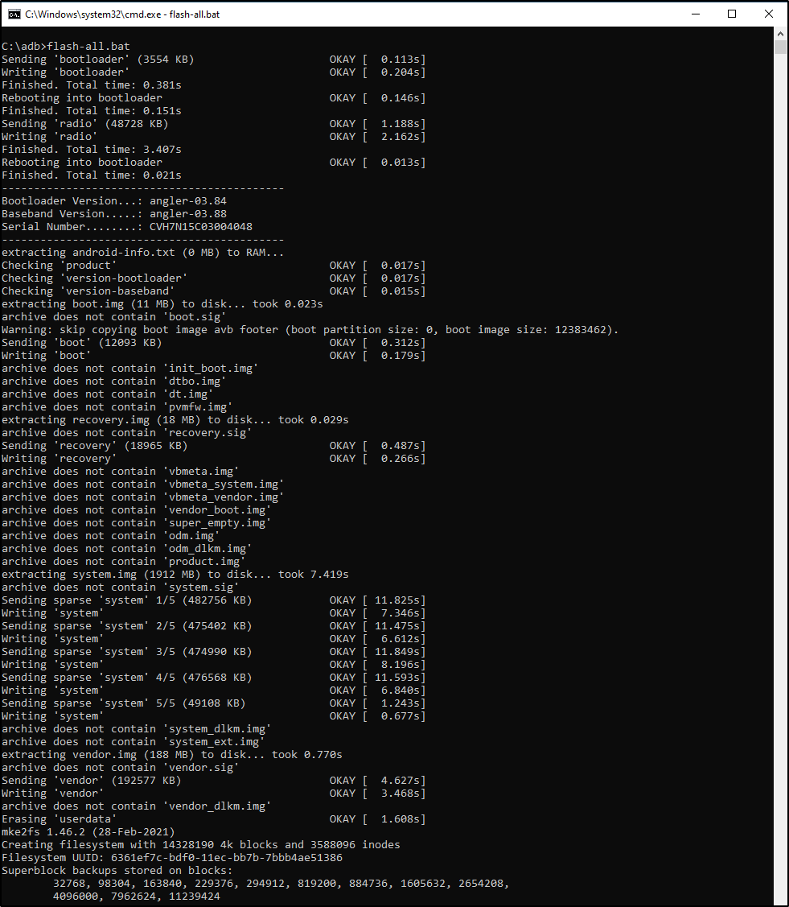

# Nethunter Setup
## Setup PC
1. This will use a standard installation of the Windows 10 operating system version 20H2


2. Create a new folder in C:\ named adb.


3. Download the ADB drivers for Android, go to this website https://developer.android.com/studio/run/win-usb and click on the link "Click here to download the Google USB Driver ZIP file (ZIP)".


4. Accept the terms and conditions and select "Download the Google USB driver".


5. Copy the zip file to the C:\adb folder and extract it. Once it has been extracted the zip file can be deleted. 


6. Download the platform tools from google https://dl.google.com/android/repository/platform-tools-latest-windows.zip and extract them into the root of the C:\adb folder so it now looks like this. The zip file can be deleted once the files are extracted. 


7. Set phone to Developer Mode. Go to Settings, System, About phone then tap Build number 7 times. Tap back, then tap {} Developer options. In Developer options enable
    1. Stay awake
    2. OEM unlocking
    3. USB debugging

8. Open a command prompt and navigate to the C:\adb directory then confirm the device is connected with the 'adb devices' command. 

```
cd \adb
adb devices
```

9. Restart the phone in bootloader mode. 

`adb reboot bootloader`

10. Navigate to Device Manager. Under 'Other Devices' you should have 'Android' listed with an exclamation mark, which indicates that the driver is not correctly installed. 



11. Right click on 'Android' and select 'Update driver'. 



12. Click on 'Browse my computer for drivers' 



13. Set the directory to be 'c:\adb' then click on next. 


14. When prompted click 'Install'


15. The driver should then be successfuly installed. 


16. In device manager it should now be shown as a 'Android Bootloader Interface'. 



17. Open a command prompt and navigate to the C:\adb directory and confirm that you can see the device in fastboot mode. 

```
cd \adb
fastboot devices
```


## Nexus 6p
### Revert to stock ROM

1. Navigate to https://developers.google.com/android/images#angler and Acknowledge the terms and conditions. 



2. Scroll to the bottom of '"angler" for Nexus 6p' builds and click on the download link for versiono '8.1.0 (OPM7.181205.001, Dec 2018)'. 


3. Once the download has completed extract the zip file. This should create a folder named 'angler-opm7.181205.001-factory-b75ce068' inside this folder is another folder named 'angler-opm7.181205.001'. Inside this folder contains 6 files which we will copy to the C:\adb directory. 





4. Open a command prompt and navigate to the C:\adb directory and confirm that you can see the device in fastboot mode. 

```
cd \adb
fastboot devices
```


5. Run the command 'flash-all.bat' to flash the phone back to a stock ROM. 

```
flash-all.bat
```




### Install Recovery (TWRP)

### Root phone

### Install Nethunter